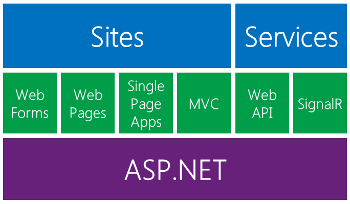

# introduction-to-asp-dot-net

## Get Started with ASP.NET

> ASP.NET is a free web framework for building great Web sites and Web applications using HTML, CSS and JavaScript. You can also create Web APIs, mobile sites, use real-time technologies like Web Sockets and more!

[ASP.NET-Get Started with ASP.NET](http://www.asp.net/get-started)

### ASP.NETとは？

[ASP.NET 入門 - ASP.NET とは？](http://aspnet.keicode.com/aspnet/what.php)

ASP.NETは、Microsoftが開発・提供しているWebアプリケーションフレームワークです。

Microsoftが提供している Visual Web Developer や Visual Studio などの
統合開発環境 (`IDE`) を用いると、 HTML や HTTP などの基本的な Webテクノロジーに
精通していなくても Webアプリケーションを開発できるのが特徴です。

---

多くの場合、ASP.NETの開発にはVisual Studioを使用すると思いますが
さすがに長い歴史を持つIDEなだけあって、基本的なコードを予め生成してくれたり
優秀なコード補完やリファクタリング機能が備わっています。

コード量が少なければ それだけ早く開発できますし、不具合が混入する割合も少なくなります。

一昔前はマシンパワーの問題でストレスもあったのですが、
最近のPCであればデバッグしつつの開発であってもVisual Studioのエディタが固まってコーディングできない、
なんて現象はほとんど発生しなくなりました。

---

### ASP.NET概要

`ASP.NET`のコアを土台に、サイト作成用の技術とサービス作成用の技術が構築されています。

* Sites

サーバーからHTMLなどを返すアプリケーションを作成する技術です。

後ほど各要素について詳しく説明します。

* Services

サーバーからXMLやJSONなどを返すアプリケーションを作成する技術です。

多くの場合はエンドユーザーから直接呼び出されることはなく、
クライアントとなるプログラムから呼び出されます。

クライアント側は受け取ったデータを処理した上で画面に表示します。

  - `ASP.NET Web API` は RESTスタイルのAPI開発に使用します。
  - `ASP.NET SignalR` は `WebSocket`のようなサーバー-ブラウザ間の双方向リアルタイム通信を実現するためのライブラリです。

#### Building Web Sites in ASP.NET

ASP.NETでは、Webアプリケーションを作成するため、以下の3つのフレームワークを提供しています。

|                   | 開発スタイル | If you have experience in |
| ----------------- | -------- | ------------------------- |
| ASP.NET Web Forms | HTMLとコードを同じファイルに記載 | Windows Form, WPF, .NET |
| ASP.NET Web Pages | 豊富なHTMLをカプセル化したコントロールのライブラリを使用した高速開発 | Classic ASP, PHP        |
| ASP.NET MVC       | MVC(Model, View, Controller)スタイルの開発 | Ruby on Rails, .NET |

上記の図にある `Single Page Application` は `ASP.NET MVC` の発展型です。

---

#### 今後取り上げる内容について

以下の様な内容を解説していきます。

1. [`ASP.NET Web Forms`を使用した簡単なWebアプリケーションの開発手順について](step1/step1.html)
2. [`ASP.NET MVC`によるWebアプリケーション開発 - 基礎編](step2/step2.html)
3. [`ASP.NET MVC`によるWebアプリケーション開発 - 応用編](step2.1/step2.1.html)
4. [`ASP.NET Web API`によるREST API開発](step3/step3.html)
5. [`ASP.NET Web API`と`knockout.js`によるSingle Page Application開発 (前編)](step4/step4.html)
6. [`ASP.NET Web API`と`knockout.js`によるSingle Page Application開発 (後編)](step5/step5.html)

---

 

### おまけ

* [build2015まとめ](./appendix/build2015.html)
* [vscodeについて](./appendix/vscode.html)
* [connect2015まとめ](./appendix/connect2015.html)

 

---

  

各ページのサンプルコードは [Github](https://github.com/Kazunori-Kimura/introduction-to-asp-dot-net) にアップしています。

また、このページの元となるファイルも上記レポジトリで管理していますので、
誤り等あれば`Issue`など登録してください。
