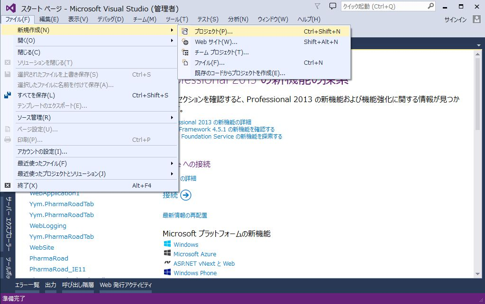
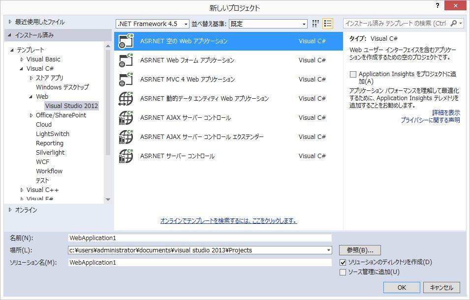
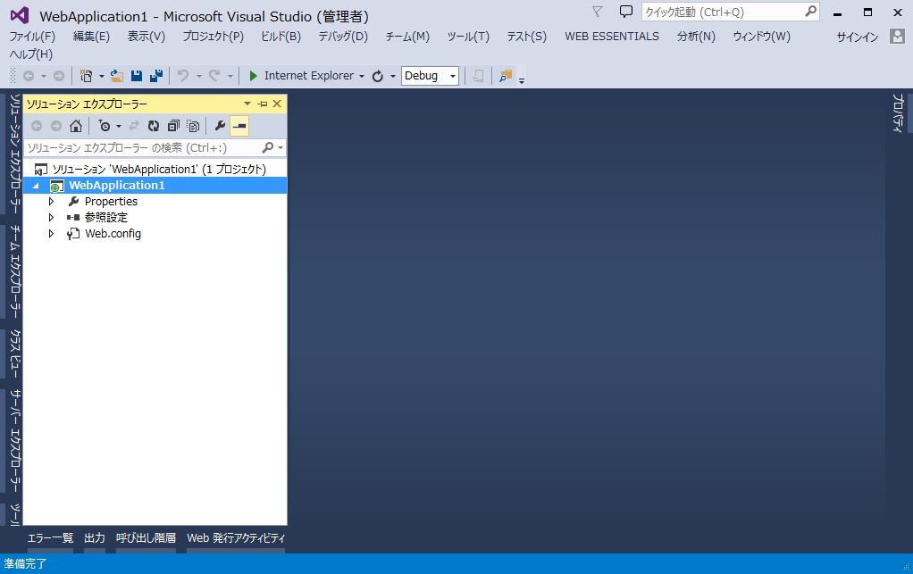
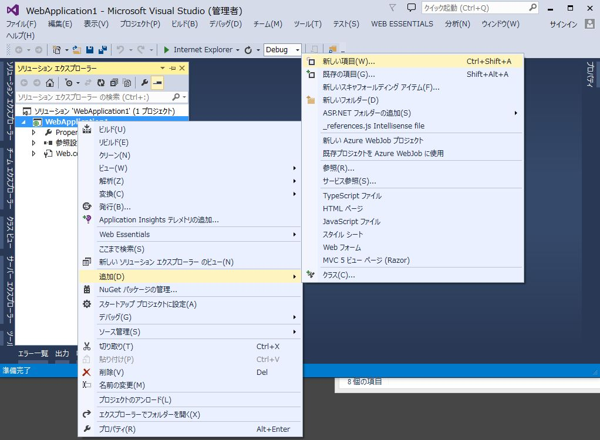
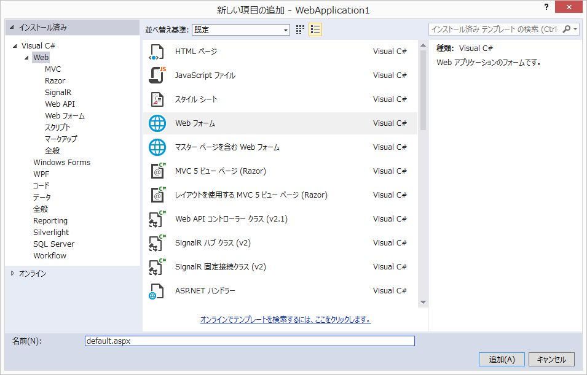
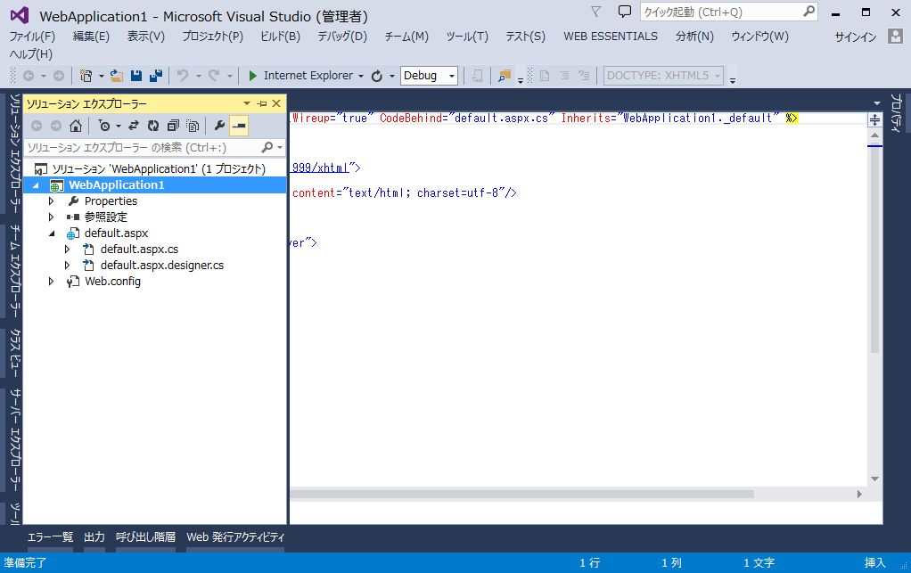
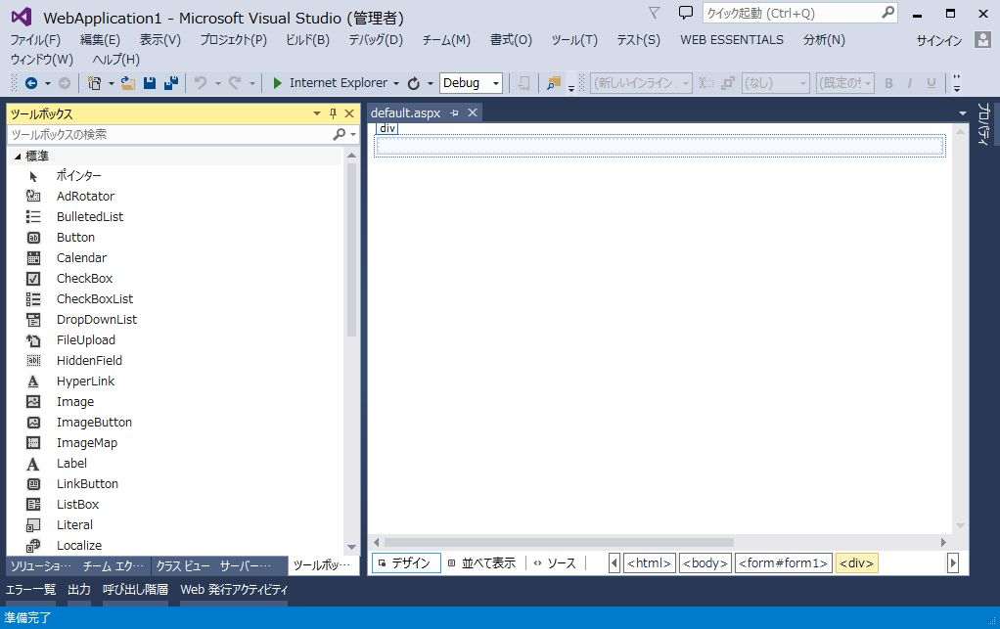
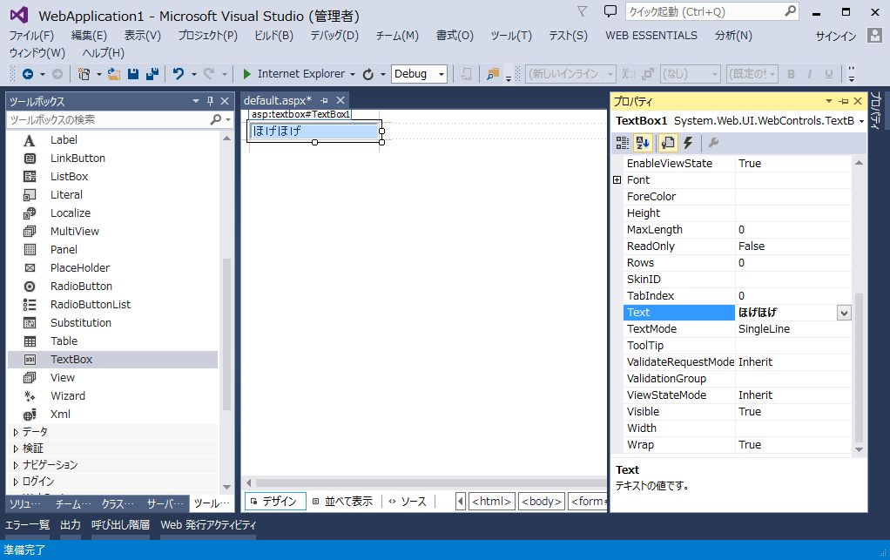
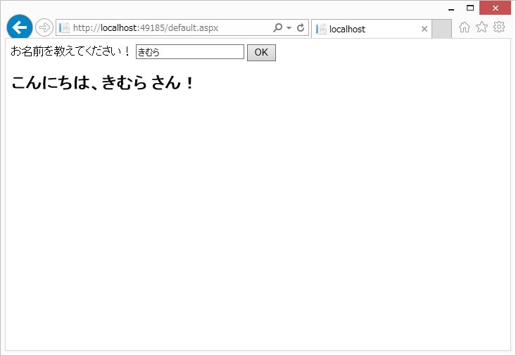

# 1. `ASP.NET Web Forms`を使用した簡単なWebアプリケーションの開発手順について

## `ASP.NET Web Forms`の概要

`ASP.NET Web Forms` のページは HTML、クライアント スクリプト、サーバー コントロールと
サーバー コードを組み合わせて記述します。

ユーザーからページが要求 (request) されると、.NET Frameworkによりサーバー上でコンパイル・実行され、ブラウザでレンダリングできるHTMLマークアップを生成します。

Visual Studioを使用して `ASP.NET Web Forms` のページを作成することができます。
Visual StudioではサーバーコントロールをWebフォームのレイアウトにドラッグアンドドロップできます。
その後、Webページの動作、ルックアンドフィールを定義するためにプロパティ、メソッド、およびイベントを設定します。
ページのロジックを処理するためのサーバーコードを作成するには、
`C#` または `Visual Basic` などの.NET言語を使用することができます。

* [Introduction to ASP.NET Web Forms](http://www.asp.net/web-forms/what-is-web-forms)

---

## 簡単なWebアプリケーションの構築

### アプリケーション仕様

* テキストボックスに名前を入力しボタンをクリックすると、ラベルに「こんにちは、○○ さん！」というメッセージを表示する。
* テキストボックス未入力時は名前の入力を促すメッセージを表示する。

### 開発手順

Visual Studio 2013 を使用して Webアプリケーションを作成する手順です。

(1) 新規プロジェクトの作成

Visual Studioを起動し、「ファイル」→「新規作成」→「プロジェクト」を選択します。



左側ツリーを「インストール済み」→「テンプレート」→「Visual C#」→「Web」の順に展開していきます。
中央ペインにて「ASP.NET 空の Web アプリケーション」を選択します。

名前、ソリューション名は適当で結構です。



    「ASP.NET Webフォーム アプリケーション」を選択すると、最初から様々なファイルがプロジェクトに含まれています。
    今回は認証機能などの無い、1ページだけのアプリケーションを作成したいので、空のテンプレートを使用します。



(2) Webフォームの追加

プロジェクトを右クリックし、「追加」→「新しい項目」を選択します。



「Webフォーム」を選択し、名前を「default.aspx」とし、「追加」をクリックします。



以下のファイルが追加されます。
* default.aspx
* default.aspx.cs
* default.aspx.designer.cs



(3) サーバーコントロールの配置

`default.aspx`を開いた状態で、左下の「デザイン」をクリックします。
「ツールボックス」を表示します。



`default.aspx`の`div`に`TextBox`をドラッグアンドドロップで配置します。
「プロパティ」で`Text`に適当な値を設定します。



左下の「ソース」をクリックします。
以下のようになっています。

```html
<%@ Page Language="C#" AutoEventWireup="true" CodeBehind="default.aspx.cs" Inherits="WebApplication1._default" %>

<!DOCTYPE html>

<html xmlns="http://www.w3.org/1999/xhtml">
<head runat="server">
<meta http-equiv="Content-Type" content="text/html; charset=utf-8"/>
    <title></title>
</head>
<body>
    <form id="form1" runat="server">
    <div>

        <asp:TextBox ID="TextBox1" runat="server">ほげほげ</asp:TextBox>

    </div>
    </form>
</body>
</html>
```

`F5`キーを押すとデバッグ実行できます。
ブラウザが起動し、テキストボックスが表示されることを確認します。
ブラウザを閉じると、デバッグ実行が終了します。

「ツールボックス」から`Label`を2つ、`Button`を1つ配置します。
ソースが以下のようになるように配置してください。

```html
<%@ Page Language="C#" AutoEventWireup="true" CodeBehind="default.aspx.cs" Inherits="WebApplication1._default" %>

<!DOCTYPE html>

<html xmlns="http://www.w3.org/1999/xhtml">
<head runat="server">
<meta http-equiv="Content-Type" content="text/html; charset=utf-8"/>
    <title></title>
</head>
<body>
    <form id="form1" runat="server">
    <div>

        <asp:Label ID="Label1" runat="server" Text="お名前を教えてください！"></asp:Label>
        <asp:TextBox ID="TextBox1" runat="server"></asp:TextBox>
        <asp:Button ID="Button1" runat="server" OnClick="Button1_Click" Text="OK" />
        <br />
        <br />
        <asp:Label ID="Label2" runat="server" Font-Bold="True" Font-Size="X-Large"></asp:Label>

    </div>
    </form>
</body>
</html>
```

(4) イベントの設定

「ソース」にて`<asp:Button>`にカーソルを移動させます。
「プロパティ」にて「イベント」(雷のようなボタン)をクリックします。
`Click`を選択し、Enterキーを押します。

`default.aspx.cs` に `protected void Button1_Click`メソッドが生成されます。

以下の様にコードを記述します。

```cs
using System;
using System.Collections.Generic;
using System.Linq;
using System.Web;
using System.Web.UI;
using System.Web.UI.WebControls;

namespace WebApplication1
{
    public partial class _default : System.Web.UI.Page
    {
        protected void Page_Load(object sender, EventArgs e)
        {

        }

        /// <summary>
        /// OKボタンのクリック
        /// </summary>
        /// <param name="sender"></param>
        /// <param name="e"></param>
        protected void Button1_Click(object sender, EventArgs e)
        {
            // 名前を取得
            string name = TextBox1.Text;

            string message = string.Empty;
            if (string.IsNullOrEmpty(name))
            {
                // 名前が未入力
                message = "お名前を入力してください！";
            }
            else
            {
                message = string.Format("こんにちは、{0} さん！", name);
            }

            // ラベルにメッセージをセット
            Label2.Text = message;
        }
    }
}
```

メソッド上部の `///` から始まるコメントは *ドキュメント コメント* と呼ばれ、JavaでいうJavaDoc的な記法です。
メソッド宣言の上の行で `///` とタイプすると、`<sammary>`や`<param>`といったタグが自動生成されます。
クラスや定数、メンバ変数でもドキュメントコメントを設定できます。

Visual Studioのエディタでドキュメントコメントが記述されたメソッド等にマウスカーソルを合わせると、ドキュメントコメントの内容がツールチップに表示されます。
また、コード補完時にもドキュメントコメントの内容が表示されます。

* [ドキュメント コメント用の推奨タグ](http://msdn.microsoft.com/ja-jp/library/5ast78ax.aspx)

(5) デバッグ実行

`F5`キーを押してデバッグ実行してください。

テキストボックスに名前を入力し、OKボタンを押下すると
ラベルに入力した値が反映されることを確認します。



<br>
<br>

---

<br>
<br>

`ASP.NET Web Forms`でのWebアプリケーションの開発手順について解説しました。

Windows デスクトップ アプリケーションの開発手法に近いイメージでWebアプリケーションの開発ができることを
実感いただけたかと思います。

今回取り上げたテキストボックスとラベル以外にも、チェックボックスやラジオボタン、リストボックスといった
サーバーコントロールが用意されていますので、もっと凝ったアプリケーションも開発可能です。


デバッグ実行したブラウザでソースコードを見ると分かりますが、サーバーサイドでは`<asp:TextBox>`という
単純なタグですが、実際にクライアントに返ってくるHTMLは.NET Frameworkが生成した、もう少し複雑なコードになっています。

昨今のWebアプリケーションの傾向として、 jQueryなどのJavaScriptライブラリを活用した
動きのあるサイト(ユーザーの操作によって一部分だけが更新されたり、非同期で処理がされる)が主流ですが、
`ASP.NET Web Forms`では実際にレンダリングされるHTMLが.aspxの内容と異なるため、クライアント側のコーディングがやりにくいです。

非同期通信等を多用する場合は `ASP.NET Ajax Control` といったライブラリも用意されていますが、
より複雑さが増してしまうので、次回取り上げる `ASP.NET MVC` を使用して
サーバーサイドとクライアントサイドを明確に分けて構築するスタイルを導入するのが良いでしょう。
