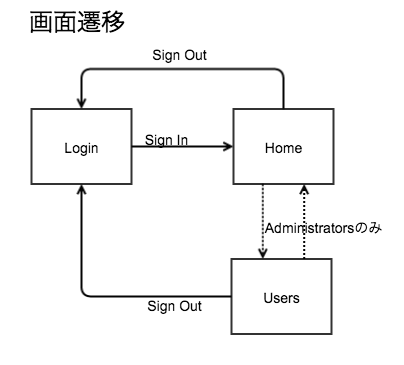
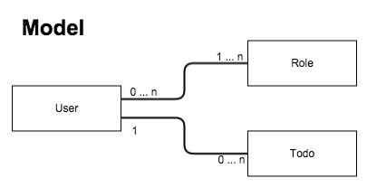

# 3. `ASP.NET MVC`によるWebアプリケーション開発 - 応用編

<br>

## ASP.NETの認証機能について

### メンバーシップ フレームワーク

ASP.NET 2.0 以降から採用された認証ライブラリです。比較的シンプルに実装できるため、広く利用されています。  
今回はメンバーシップフレームワークによる認証・認可機能の実装方法を解説します。

<br>
<hr>
<br>

### 【用語解説】ASP.NET Identity

ASP.NET Identity は Visual Studio 2013 から新たに搭載された認証ライブラリです。

以下の様な特徴があります。

- Entity Framework を基板としているため、アカウント情報の管理に関する実装が容易である
- ActiveDirectoryによる認証に対応
- Twitter, Facebook, Googleなどのソーシャルアカウントによる認証に対応

Visual Studio 2013 で ASP.NETプロジェクトを作成するときに生成されるソースコードには、ASP.NET Identityによる認証機能が予め実装されています。

<br>
<hr>
<br>

## 基本的なフォーム認証の実装

簡単なWebアプリケーションの作成を題材に、フォーム認証の実装方法について解説します。

実際のソースコードは [こちら](https://github.com/Kazunori-Kimura/introduction-to-asp-dot-net/tree/master/projects/step2/TodoApp) で確認できます。
<br>

### 概要

* 画面構成
  - ログイン画面
  - ホーム画面 (全ユーザー共通の画面)
  - 管理画面 (管理者アカウントのみ表示可能)

<br>

* 画面遷移

    ログイン画面 -(ログイン成功)-> ホーム画面 -(管理者のみ)-> 管理画面

<br>
<br>

### 1. Providerクラスの実装

さっそく、認証機能を司る `Provider` クラスを作成していきます。

<br>

(1) MembershipProviderの実装

`MembershipProvider` クラスを継承したクラスを実装します。

幾つか `override` しないといけないメソッドがありますが、
今回使用するのは `ValidateUser` メソッドだけなので、このメソッドのみ実装します。

- `ValidateUser` は `username` と `password` を受け取って認証の成否を返します。

認証の動作を確認するため、ひとまず `username` 、 `password` は固定としています。

<br>

* `CustomMembershipProvider.cs`

```cs
namespace TodoApp.Models
{
    public class CustomMembershipProvider : MembershipProvider
    {
        public override bool ValidateUser(string username, string password)
        {
            // とりあえず固定で認証
            if ("administrator".Equals(username) && "password".Equals(password))
            {
                return true;
            }
            if ("user".Equals(username) && "password".Equals(password))
            {
                return true;
            }
            return false;
        }

        // 〜〜略〜〜
```

<br>

(2) RoleProviderの実装

つづいて、 `RoleProvider` クラスを継承したクラスを実装します。

`MembershipProvider` と同様、今回使用するメソッドのみ中身を実装します。

- `IsUserInRole` メソッドは 指定されたユーザーが、該当するロールに所属しているかどうかを返します。
- `GetRolesForUser` メソッドは 指定されたユーザーが所属するロールの配列を返します。

<br>

* CustomRoleProvider.cs

```cs
namespace TodoApp.Models
{
    public class CustomRoleProvider : RoleProvider
    {
        public override bool IsUserInRole(string username, string roleName)
        {
            if ("administrator".Equals(username) && "Administrators".Equals(roleName))
            {
                return true;
            }
            if ("user".Equals(username) && "Users".Equals(roleName))
            {
                return true;
            }
            return false;
        }

        public override string[] GetRolesForUser(string username)
        {
            if ("administrator".Equals(username))
            {
                return new string[] { "Administrators" };
            }
            return new string[] { "Users" };
        }

        // 〜〜略〜〜
```

<br>
<br>

### 2. ViewModelの実装

`ViewModel` は実際のModel (テーブルの形) と画面に表示する項目との違いを吸収するために使用するテクニックです。

画面とコントローラとのやりとりは `ViewModel` を介して行います。

画面からの入力内容をデータベースに反映する場合に コントローラにて `ViewModel` からデータを取得し、
`Model` にデータを格納して、データベースに保存します。


今回はログイン画面の入力項目を `LoginViewModel` として定義します。

<br>

* LoginViewModel.cs

```cs
namespace TodoApp.Models
{
    public class LoginViewModel
    {
        [Required]
        [DisplayName("ユーザー名")]
        public string UserName { get; set; }

        [Required]
        [DisplayName("パスワード")]
        public string Password { get; set; }
    }
}
```

<br>

### 3. Controllerの実装

(1) LoginControllerの実装

```cs
namespace TodoApp.Controllers
{
    [AllowAnonymous]
    public class LoginController : Controller
    {
        readonly CustomMembershipProvider membershipProvider = new CustomMembershipProvider();

        // GET: Login
        public ActionResult Index()
        {
            return View();
        }

        [HttpPost]
        [ValidateAntiForgeryToken]
        public ActionResult Index([Bind(Include="UserName,Password")] LoginViewModel model)
        {
            if (ModelState.IsValid)
            {
                if (this.membershipProvider.ValidateUser(model.UserName, model.Password))
                {
                    FormsAuthentication.SetAuthCookie(model.UserName, false);
                    return RedirectToAction("Index", "Home");
                }
            }
            ViewBag.Message = "ログインに失敗しました。";
            return View(model);
        }

        public ActionResult SignOut()
        {
            FormsAuthentication.SignOut();
            return RedirectToAction("Index");
        }
    }
}
```

* `[AllowAnonymous]` は `LoginController` 全体へのアクセスで、認証を不要とします。
* `[HttpPost] Index` で認証処理を行います。

ログイン画面で入力された内容は `LoginViewModel` に格納されます。

送られてきたユーザー名、パスワードを `MembershipProvider` でチェックし、認証OKであれば
`FormsAuthentication.SetAuthCookie` メソッドを実行します。

第2引数の boolean は、認証クッキーを残すかどうかのフラグです。
ログイン画面によくある、「次回から自動的にログイン」とか「ログインしたままにする」といったチェックボックスの機能です。

認証後、Home画面にリダイレクトしています。

* `SignOut` メソッドで認証クッキーが削除され、ログアウトした状態となります。

<br>

(2) HomeControllerの実装

* HomeController.cs

```cs
namespace TodoApp.Controllers
{
    [Authorize]
    public class HomeController : Controller
    {
        // GET: Home
        public ActionResult Index()
        {
            return View();
        }
    }
}
```

`[Authorize]` は `HomeController` にアクセスするために認証が必要であることを示します。

認証されていない状態でアクセスすると、ログイン画面にリダイレクトされます。

<br>

(3) AdminControllerの実装

```cs
namespace TodoApp.Controllers
{
    [Authorize(Roles="Administrators")]
    public class AdminController : Controller
    {
        // GET: Admin
        public ActionResult Index()
        {
            return View();
        }
    }
}
```

`[Authorize(Roles="Administrators")]` は `AdminController` に `Administrators` ロールに属するユーザーのみアクセス可能であることを示します。

それ以外のユーザーが該当画面にアクセスした場合、ログイン画面にリダイレクトされます。

<br>
<br>

### 3. Viewの作成

(1) `/Views/Shared/_LayoutPage1.cshtml` の作成

  - `Shared` フォルダの作成
  - レイアウトページの作成

後半のパートで使用しますので、共通レイアウトを定義しておきます。

<br>

(2) `/Views/Login/Index.cshtml` の作成

  - `LoginController`を右クリック -> `Add View` を選択
  - `LoginViewModel` の `Create` として `Index.cshtml` を作成
  - 不要な項目の削除 (フォームのタイトル部分)
  - ボタンのラベルを `SignIn` に変更

<br>

```html
@model TodoApp.Models.LoginViewModel

@{
    ViewBag.Title = "Index";
    Layout = "~/Views/Shared/_LayoutPage1.cshtml";
}

<h2>SignIn</h2>

@using (Html.BeginForm())
{
    @Html.AntiForgeryToken()

    <div class="form-horizontal">
        @Html.ValidationSummary(true, "", new { @class = "text-danger" })
        <div class="form-group">
            @Html.LabelFor(model => model.UserName, htmlAttributes: new { @class = "control-label col-md-2" })
            <div class="col-md-10">
                @Html.EditorFor(model => model.UserName, new { htmlAttributes = new { @class = "form-control" } })
                @Html.ValidationMessageFor(model => model.UserName, "", new { @class = "text-danger" })
            </div>
        </div>

        <div class="form-group">
            @Html.LabelFor(model => model.Password, htmlAttributes: new { @class = "control-label col-md-2" })
            <div class="col-md-10">
                @Html.EditorFor(model => model.Password, new { htmlAttributes = new { @class = "form-control" } })
                @Html.ValidationMessageFor(model => model.Password, "", new { @class = "text-danger" })
            </div>
        </div>

        <div class="form-group">
            <div class="col-md-offset-2 col-md-10">
                <input type="submit" value="SignIn" class="btn btn-default" />
            </div>
        </div>
    </div>
}

<script src="~/Scripts/jquery-1.10.2.min.js"></script>
<script src="~/Scripts/jquery.validate.min.js"></script>
<script src="~/Scripts/jquery.validate.unobtrusive.min.js"></script>
```

<br>

(3) HomeViewの作成

(4) AdminViewの作成

  - `Title` に `Home`, `Admin` と表記 (どちらの画面を表示しているかわかりやすいように)
  - `Home` と `Admin` を相互に遷移できるようにリンクを追加

<br>

### 4. web.configの設定

最後に、フォーム認証を行うように `web.config` に設定を追加します。

```xml
<system.web>
  <compilation debug="true" targetFramework="4.5.1"/>
  <httpRuntime targetFramework="4.5.1"/>
  <authentication mode="Forms">
    <forms loginUrl="~/Login/Index"></forms>
  </authentication>
  <membership defaultProvider="CustomMembershipProvider">
    <providers>
      <clear/>
      <add name="CustpmMembershipProvider" type="TodoApp.Models.CustomMembershipProvider"/>
    </providers>
  </membership>
  <roleManager enabled="true" defaultProvider="CustomRoleProvider">
    <providers>
      <clear/>
      <add name="CustomRoleProvider" type="TodoApp.Models.CustomRoleProvider"/>
    </providers>
  </roleManager>
</system.web>
```

* `authentication` タグの追加
  - `mode="Forms"` でフォーム認証を行うことを指定
  - `forms` タグでログイン画面を指定
* `membership` タグの追加
  - `CustomMembershipProvider` クラスを指定
* `roleManager` タグの追加
  - `CustomRoleProvider` クラスを指定

<br>
<br>

### 5. デバッグ実行して動作確認

- ログイン画面が表示されることを確認
- user / password でログインし ホーム画面に遷移することを確認
- Adminリンクをクリックするとログイン画面に戻されることを確認
- URLを指定して ~/Home/Index を指定してもログイン画面に戻されることを確認
- URLを指定して ~/Admin/Index を指定してもログイン画面に戻されることを確認
- administrator / password でログインし ホーム画面に遷移することを確認
- Adminリンクをクリックして管理画面に遷移することを確認
- SignOutリンクをクリックしてログイン画面に遷移することを確認
- URLを指定して ~/Home/Index を指定してもログイン画面に戻されることを確認
- URLを指定して ~/Admin/Index を指定してもログイン画面に戻されることを確認

<br>
<br>

ASP.NET MVCでのフォーム認証の基本的な実装について解説しました。

<br>
<hr>
<br>

## (まともな) Todo管理アプリケーションの作成

つづいて、ユーザー管理機能のついた Todo管理アプリケーションを作成します。

* ユーザー毎に個別のTodoを管理
* 管理者のみユーザーアカウントの管理画面を表示

先ほど作成した認証機能だけのWebアプリケーションに必要な機能を肉付けしていきます。

<br>
実際のソースコードは [こちら](https://github.com/Kazunori-Kimura/introduction-to-asp-dot-net/tree/master/projects/step2/TodoApp_2) で確認できます。
<br>

### システム仕様

1. 画面遷移




2. モデル関連



<br>

### 1. Modelの実装

* Models/User.cs

```cs
public class User
{
    public int Id { get; set; }

    [DisplayName("名前")]
    [Required]
    public string UserName { get; set; }

    [DisplayName("パスワード")]
    [Required]
    public string Password { get; set; }

    [DisplayName("役割")]
    public virtual ICollection<Role> Roles { get; set; }

    [DisplayName("Todo")]
    public virtual ICollection<Todo> Todoes { get; set; }
}
```

ユーザー名とパスワードに加えて、
ユーザーが所属する `Role` のリスト (将来の拡張を見越して、1ユーザーは複数ロールに所属可能とする) と
そのユーザーが持つ `Todo` のリストをプロパティとして定義します。

<br>

* Models/Role.cs

```cs
public class Role
{
    public int Id { get; set; }
    public string RoleName { get; set; }
    public virtual ICollection<User> Users { get; set; }
}
```

ロール名に加えて、そのロールに所属するユーザーのリストをプロパティとして定義します。

<br>

* Models/Todo.cs

```cs
public class Todo
{
    public int Id { get; set; }

    [DisplayName("タイトル")]
    [Required]
    public string Title { get; set; }

    [DisplayName("内容")]
    public string Detail { get; set; }

    [DisplayName("完了")]
    public bool Done { get; set; }

    [DisplayName("担当者")]
    public virtual User User { get; set; }
}
```

そのTodoを担当するユーザーをプロパティとして定義します。
ユーザーとTodoは 1:n とします。

<br>

* AppContext

```cs
public class AppContext : DbContext
{
    public DbSet<User> Users { get; set; }
    public DbSet<Role> Roles { get; set; }
    public DbSet<Todo> Todoes { get; set; }
}
```

DbContext クラスです。
データベースと紐付ける Modelクラス の DbSet を定義します。

<br>

* LoginViewModel

元から変更ありません。

```cs
public class LoginViewModel
{
    [Required]
    [DisplayName("ユーザー名")]
    public string UserName { get; set; }

    [Required]
    [DisplayName("パスワード")]
    public string Password { get; set; }
}
```

<br>
<hr>
<br>

### 【用語解説】ナビゲーションプロパティ

`User` モデルの `public virtual ICollection<Role> Roles` や
`Todo` モデルの `public virtual User User` は *ナビゲーションプロパティ* と呼ばれ、
モデル間の関連を表します。

`User` と `Todo` のような *1:n* の関係の場合、 *ナビゲーションプロパティ* によって
`Todoes` テーブルに `User_Id` という外部キーが作成されます。

`User` と `Role` のような *m:n* の関係の場合、 *ナビゲーションプロパティ* によって
`UserRoles` テーブルが生成されます。

<br>
<hr>
<br>

### 2. Providerの実装

固定文字列で認証等の判定を行っていたところを
EntityFrameworkを通してデータベースに問い合わせた結果と入力内容を比較するように修正します。

<br>

* CustomMembershipProvider

```cs
public override bool ValidateUser(string username, string password)
{
    using (var db = new AppContext())
    {
        var user = db.Users
            .Where(u => u.UserName == username && u.Password == password)
            .FirstOrDefault();

        if (user != null)
        {
            // 認証OK
            HttpContext.Current.Session["AuthUserId"] = user.Id;
            return true;
        }
    }
    return false;
}
```

username, passwordを元にユーザーを取得し、ユーザーが取得できた場合は
認証OKとして Session にユーザーのId を格納しています。

<br>

`FirstOrDefault` メソッドは `Where` でヒットした要素のうちの先頭のモノを返します。
0件の場合は `null` を返します。

`First` メソッドを使用すると、0件だった際に例外が発生します。

どちらを使用するかは好みの問題だと思いますが、私はむやみに例外を発生させるのは好きではないので
このような処理にしています。

<br>

* CustomRoleProvider

```cs
public override bool IsUserInRole(string UserId, string roleName)
{
    using (var db = new AppContext())
    {
        var user = db.Users
            .Where(u => u.Id == int.Parse(UserId))
            .FirstOrDefault();

        string[] roles = user.Roles.Select(r => r.RoleName).ToArray();

        if (roles.Contains(roleName))
        {
            return true;
        }
    }

    return false;
}
```

```cs
public override string[] GetRolesForUser(string UserId)
{
    using (var db = new AppContext())
    {
        int id = int.Parse(UserId);
        var user = db.Users
            .Where(u => u.Id == id)
            .FirstOrDefault();

        string[] roles = user.Roles.Select(r => r.RoleName).ToArray();

        return roles;
    }
}
```

<br>
<hr>
<br>

### 【用語解説】LINQ to Entities

*L*anguage *IN*tegrated *Q*uery (統合言語クエリー)

オブジェクトやデータベース、データセット、エンティティ、XMLなどアプリケーションで扱う
様々なデータソースに対して、統一的な手段でアクセスする仕組みです。

LINQによる問い合わせはクエリー式構文とメソッド構文の2通りの書き方ができます。

* クエリ構文

```cs
var users = from u in db.Users
  where u.UserName == model.UserName && u.Password == model.Password
  select u;
```

* メソッド構文

```cs
var users = db.Users
  .Where(u => u.UserName == model.UserName && u.Password == model.Password)
  .Select();
```

クエリ構文だけでは表現できない機能 (FirstOrDefaultメソッドなど) もあります。
個人的にメソッド構文の方が分かりやすいので、この勉強会ではメソッド構文を使用していきます。

<br>
<hr>
<br>

### 3. 初期データの登録

(1) マイグレーションの有効化

*マイグレーション* とは、モデルの内容に合わせてデータベースを作成・変更するための仕組みです。

EntityFrameworkのマイグレーション機能により、モデルの変更を自動的に検知し、テーブルレイアウトを変更してくれます。


* TOOLS -> NuGet Package Manager -> Package Manager Console を選択します。

`Package Manager Console` が表示されるので、以下のコマンド (1行目) を入力します。

```
PM> Enable-Migrations -ContextTypeName TodoApp.Models.AppContext
Checking if the context targets an existing database...
Code First Migrations enabled for project TodoApp.
```

`Migrations/Configuration.cs` というファイルが生成されます。

<br>

(2) イニシャライザーの登録

実行時に `Configuration.cs` の `Seed` メソッドが実行されるように
`Global.asax.cs` に追記します。

```cs
protected void Application_Start()
{
    AreaRegistration.RegisterAllAreas();
    RouteConfig.RegisterRoutes(RouteTable.Routes);

    Database.SetInitializer(new MigrateDatabaseToLatestVersion<AppContext, Configuration>());
}
```

<br>

(3) 自動マイグレーションの有効化

`Migrations/Configuration.cs` の `Configuration` メソッドにて
自動マイグレーションを有効にします。

```cs
public Configuration()
{
    AutomaticMigrationsEnabled = true;
    AutomaticMigrationDataLossAllowed = true;
}
```

`AutomaticMigrationDataLossAllowed` はデータが失われるような変更 (列が削除されるなど) の自動マイグレーションを許可するかどうかのオプションです。

<br>
<hr>
<br>

### 【解説】手動マイグレーションの方法について

自動マイグレーションを無効化した状態でモデルに変更を加えると、
次のデバッグ実行時に「Code First Migrations を使用したデータベースの更新を検討してください」といったエラーメッセージが表示されます。

以下のコマンドで手動マイグレーションファイルを作成します。

```
Add-Migration AddPropertiesToModel
```

`AddPropertiesToModel` は任意の文字列で構いませんが
後から、モデルにどのような変更を行った時のマイグレーションファイルなのか分かるように名前を付けます。

コマンドを実行すると、 `Migrations/XXXXXXXXXX_AddPropertiesToModel.cs` というファイルが生成されます。
XXXXXXXXXXはコマンド実行時のタイムスタンプです。

マイグレーションファイルは、前回のマイグレーション以降にモデルに対して加えられた変更を自動的に認識しコードを生成します。

自動生成されたファイルはそのまま使用しても構いませんし、初期値を設定するなどの修正を加えても構いません。

マイグレーションファイルの準備ができたら、以下のコマンドを実行します。

```
Update-Database -Verbose
```

`-Verbose` はマイグレーション実行時の詳細なログを表示するためのオプションなので、必要なければ外して構いません。

以上で、手動でのマイグレーションは完了です。
正常にデバッグ実行できることを確認します。

<br>
<hr>
<br>

(4) 初期データの登録

アプリ実行後、管理者アカウントの登録およびRoleの定義を行うように `Seed` メソッドに処理を書いていきます。

```cs
protected override void Seed(TodoApp.Models.AppContext context)
{
    User user1 = new User()
    {
        Id = 1,
        UserName = "kimura",
        Password = "password",
        Roles = new List<Role>(),
        Todoes = new List<Todo>()
    };

    Role role1 = new Role()
    {
        Id = 1,
        RoleName = "Administrators",
        Users = new List<User>()
    };
    Role role2 = new Role()
    {
        Id = 2,
        RoleName = "Users",
        Users = new List<User>()
    };

    user1.Roles.Add(role1);
    role1.Users.Add(user1);

    context.Users.AddOrUpdate(u => u.Id, user1);

    context.Roles.AddOrUpdate(r => r.Id, role1, role2);
}
```  

<br>
<br>

### 4. コントローラー

(1) LoginController

```cs
[AllowAnonymous]
public class LoginController : Controller
{
    readonly CustomMembershipProvider membershipProvider = new CustomMembershipProvider();

    // GET: Login
    public ActionResult Index()
    {
        return View();
    }

    [HttpPost]
    [ValidateAntiForgeryToken]
    public ActionResult Index([Bind(Include="UserName,Password")] LoginViewModel model)
    {
        if (this.membershipProvider.ValidateUser(model.UserName, model.Password))
        {
            // Sessionからユーザー情報を取得
            int userId = (int)Session["AuthUserId"];
            // 認証Cookieを登録
            FormsAuthentication.SetAuthCookie(userId.ToString(), false);
            return RedirectToAction("Index", "Home");
        }

        ViewBag.Message = "ログインに失敗しました。";
        return View(model);
    }

    public ActionResult SignOut()
    {
        FormsAuthentication.SignOut();
        return RedirectToAction("Index");
    }
}
```

`ValidateUser` メソッドで認証OKだった場合、SessionからユーザーIDを取得して
認証Cookieに登録します。

<br>
<hr>
<br>

### 動作確認

ここまで実装したら、一度デバッグ実行して認証機能が正常に動作するか確認します。

修正前と変りなく、認証機能が動作することを確認します。

<br>

動作確認したら、以降の実装で不要となるフォルダ・ファイルを削除しておきます。

- Controllers/HomeController.cs
- Controllers/AdminController.cs
- Views/Home
- Views/Admin

<br>
<hr>
<br>

(2) HomeController

* EntityFrameworkの機能で `Todo` Modelを元に `HomeController` と View を生成します。
* 生成したファイルを修正していきます。

```cs
[Authorize]
public class HomeController : Controller
{
    private AppContext db = new AppContext();

    // GET: Home
    public ActionResult Index()
    {
        int userId = (int)Session["AuthUserId"];
        var user = db.Users.Where(u => u.Id == userId).First();
        return View(todoes.ToArray());
    }

    // 〜〜中略〜〜

    [HttpPost]
    [ValidateAntiForgeryToken]
    public ActionResult Create([Bind(Include = "Id,Title,Detail,Done")] Todo todo)
    {
        if (ModelState.IsValid)
        {
            // ログインユーザーを登録
            int userId = (int)Session["AuthUserId"];
            var user = db.Users.Where(u => u.Id == userId).FirstOrDefault();
            if (user != null)
            {
                todo.User = user;
            }

            db.Todoes.Add(todo);
            db.SaveChanges();
            return RedirectToAction("Index");
        }

        return View(todo);
    }
```

1. `[Authorize]` を追加し、HomeController全体に対して認証が必要とします。
2. `[HttpGet] Index` メソッドにて、Sessionに登録されたユーザーIDを元に ログインユーザー を取得し、そのユーザーのTodoesを返すように修正します。
3. `[HttpPost] Create` メソッドにて、Sessionに登録されたユーザーIDを元に ログインユーザー を取得し、作成されたTodoの担当者として登録します。

<br>

(3) UsersController

```cs
[Authorize(Roles="Administrators")]
public class UsersController : Controller
{

    // 〜〜中略〜〜

    [HttpPost]
    [ValidateAntiForgeryToken]
    public ActionResult Create([Bind(Include = "Id,UserName,Password")] User user)
    {
        if (ModelState.IsValid)
        {
            // Users
            var role = db.Roles.Where(r => r.Id == 2).FirstOrDefault();
            if (role != null)
            {
                user.Roles = new List<Role>();
                user.Roles.Add(role);
                role.Users.Add(user);
            }

            db.Users.Add(user);
            db.SaveChanges();
            return RedirectToAction("Index");
        }

        return View(user);
    }

```

1. `[Authorize(Roles="Administrators")]` を追加し、UsersController全体に対して `Administrators` ロールに所属するユーザーのみアクセスできるようにします。
2. `[HttpPost] Create` メソッドにて 作成するユーザーが `Users` ロールに所属するよう修正します。

<br>
<br>

### 5. ビュー

(1) メニューバーの作成

全画面共通で画面上部に表示されるメニューバーを作成します。

* Shared/_PartialPage1.cshtml

```html
@{
    int userId = (int)Session["AuthUserId"];
    string[] roles = new string[] { };
    using (var db = new TodoApp.Models.AppContext())
    {
        var user = db.Users.Where(u => u.Id == userId).FirstOrDefault();
        if (user != null)
        {
            roles = user.Roles.Select(r => r.RoleName).ToArray();
        }
    }
}
<nav class="navbar navbar-inverse navbar-fixed-top">
    <div class="container-fluid">
        <div class="navbar-header">
            <a class="navbar-brand" href="#">
                TodoApp
            </a>
        </div>
        <ul class="nav navbar-nav navbar-right">
            @if (roles.Contains("Administrators"))
            {
                <li>@Html.ActionLink("Users", "Index", "Users")</li>
            }
            <li>@Html.ActionLink("SignOut", "SignOut", "Login")</li>
        </ul>
    </div>
</nav>
```

1. C#のコード部分は、ログインユーザーのロール名を配列として取得する処理です。
2. `Administrators` ロールに所属している場合、UsersController の Index へのリンクを表示します。
3. `SignOut` リンクをメニューバーに表示するようにします。

<br>

(2) Shared/_LayoutPage1.cshtml

```html
<!DOCTYPE html>

<html>
<head>
    <meta name="viewport" content="width=device-width" />
    <title>@ViewBag.Title</title>
    <link rel="stylesheet" href="https://maxcdn.bootstrapcdn.com/bootstrap/3.3.5/css/bootstrap.min.css">
    <style>
        body {
            padding-top: 70px;
        }
    </style>
</head>
<body>
    @Html.Partial("_PartialPage1")

    <div class="container">
        @RenderBody()
    </div>
</body>
</html>
```

1. `link` タグで Bootstrap を読み込みます。
2. `style` タグで 画面上部のメニューバー表示領域に `padding` を設定します。
3. `@Html.Partial("_PartialPage1")` でメニューバーを読み込みます。

<br>

(3) Login/Index.cshtml

`Login/Index.cshtml` の見た目をログイン画面っぽく修正します。

```html
@model TodoApp.Models.LoginViewModel

@{
    ViewBag.Title = "Index";
    Layout = null;
}

<!DOCTYPE html>

<html>
<head>
    <meta name="viewport" content="width=device-width" />
    <title>@ViewBag.Title</title>
    <link rel="stylesheet" href="https://maxcdn.bootstrapcdn.com/bootstrap/3.3.5/css/bootstrap.min.css">
    <style>
        body {
            padding-top: 40px;
            padding-bottom: 40px;
            background-color: #eee;
        }

        .form-signin {
            max-width: 330px;
            padding: 15px;
            margin: 0 auto;
        }

        .form-signin .form-signin-heading,
        .form-signin .checkbox {
            margin-bottom: 10px;
        }

        .form-signin .form-control {
            position: relative;
            height: auto;
            -webkit-box-sizing: border-box;
            -moz-box-sizing: border-box;
            box-sizing: border-box;
            padding: 10px;
            font-size: 16px;
        }

        .form-signin .form-control:focus {
            z-index: 2;
        }

        .form-signin input.username {
            margin-bottom: -1px;
            border-bottom-right-radius: 0;
            border-bottom-left-radius: 0;
        }

        .form-signin input.password {
            margin-bottom: 10px;
            border-top-left-radius: 0;
            border-top-right-radius: 0;
        }
    </style>
</head>
<body>
    <div class="container">
        @using (Html.BeginForm("Index", "Login", null, FormMethod.Post, new { @class = "form-signin" }))
        {
            @Html.AntiForgeryToken()
            <h2 class="form-signin-heading">Please sign in</h2>
            @Html.ValidationSummary(true, "", new { @class = "text-danger" })

            @Html.LabelFor(model => model.UserName, htmlAttributes: new { @class = "sr-only" })
            @Html.EditorFor(model => model.UserName, new { htmlAttributes = new { @class = "form-control username", placeholder = "User Name" } })
            @Html.ValidationMessageFor(model => model.UserName, "", new { @class = "text-danger" })

            @Html.LabelFor(model => model.Password, htmlAttributes: new { @class = "sr-only" })
            @Html.EditorFor(model => model.Password, new { htmlAttributes = new { @class = "form-control password", placeholder = "Password" } })
            @Html.ValidationMessageFor(model => model.Password, "", new { @class = "text-danger" })

            <input type="submit" value="SignIn" class="btn btn-lg btn-primary btn-block" />
        }
    </div>

    <script src="~/Scripts/jquery-1.10.2.min.js"></script>
    <script src="~/Scripts/jquery.validate.min.js"></script>
    <script src="~/Scripts/jquery.validate.unobtrusive.min.js"></script>
</body>
</html>
```

<br>
<br>

### 動作確認

以上で、ひと通りの機能の実装が完了しました。ざっと動作確認してみましょう。

1. まず、管理者アカウント (上記コードでは `kimura`) でログインして、新しいユーザーアカウントを作成してみます。
2. 一旦サインアウトし、作成したユーザーアカウントでログインし直します。
3. Todoを登録します。
4. ログアウトし、管理者アカウントでログインし直します。

<br>
<hr>
<br>

ユーザー管理機能を持った、少し複雑なWebアプリケーションの実装手順について解説しました。

しかしながら、このアプリケーションには以下の様な問題点・改善点があります。

* パスワード管理

今回の例ではパスワードをそのままデータベースに保存していますが
実際には salt を付けて sha256 などでハッシュ化・ストレッチングを行い、
素のパスワードはそのまま保存しないように考慮しなければなりません。

<br>

* 認証状態の保存  
ログイン画面によくある、「次回から自動的にログイン」とか「ログインしたままにする」といった機能を実装する。
* 管理者アカウントの追加・変更
* 一般ユーザーが使用できるパスワードリセット・再発行画面

上記のような機能を、どのように実装すればよいか、考えてみてください。

<br>
