# 2. `ASP.NET MVC`によるWebアプリケーション開発 - 基礎編

## `ASP.NET MVC`の概要

### MVC とは？

> [Model View Controller](http://ja.wikipedia.org/wiki/Model_View_Controller)
>
> MVC（Model View Controller モデル・ビュー・コントローラ）は、ユーザーインタフェースをもつアプリケーションソフトウェアを実装するためのデザインパターンである。
> アプリケーションソフトウェアの内部データを、ユーザーが直接参照・編集する情報から分離する。そのためにアプリケーションソフトウェアを以下の3つの部分に分割する。
> 1. model: アプリケーションデータ、ビジネスルール、ロジック、関数
> 2. view: グラフや図などの任意の情報表現
> 3. controller: 入力を受け取りmodelとviewへの命令に変換する

元々は `Smalltalk` における ウィンドウプログラム開発の設計指針として生まれたものです。

`ASP.NET MVC`は MVCのデザインパターンで ASP.NET Webアプリケーション を開発するにあたって
必須であったり、便利な機能を提供するフレームワークです。

<br>

------

### 環境について

* Visual Studio 2013
  - 最新のupdateを適用している前提です。
  - 設定によって画面の構成は異なります。(ソリューション エクスプローラーが右側にある、など)
* SQL Server LocalDB
  - Visual Studioを普通にセットアップすると、合わせてインストールされます。
* ASP.NET MVC 5
* Entity Framework 6

<br>

------

## ToDoアプリの開発

参考: [Getting Started with Entity Framework 6 Code First using MVC 5](http://www.asp.net/mvc/overview/getting-started/getting-started-with-ef-using-mvc/creating-an-entity-framework-data-model-for-an-asp-net-mvc-application)

* 以降の手順は、ASP.NET MVC 5 と Entity Framework 6 を活用して、非常にシンプルなWebアプリケーションを
簡単・簡潔に作成する事を目的にしています。
必ずこの手順で開発しなければならない、ということではありません。

<br>

### 仕様概要

* ToDoリストの一覧を表示 (index)
* ToDoをクリックすると詳細を表示 (edit)
  - 詳細ページで更新/削除

<br>

---

### プロジェクトの作成

* 「テンプレート」→「Visual C#」→「Web」を選択
* 「ASP.NET Webアプリケーション」を選択し、名前を適当に入力して「OK」をクリックします。

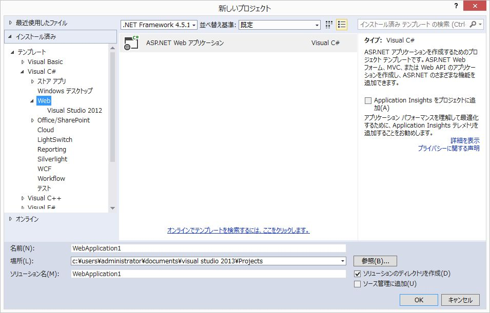


* 「テンプレートの選択」で「Empty」を選択
* 「以下にフォルダーおよびコア参照を追加：」で「MVC」にチェックしてください。
* 「OK」をクリックします。

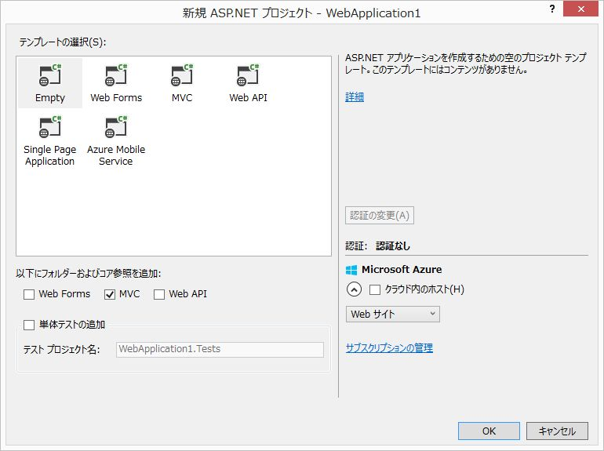

* 以下の様なフォルダ構成になります。

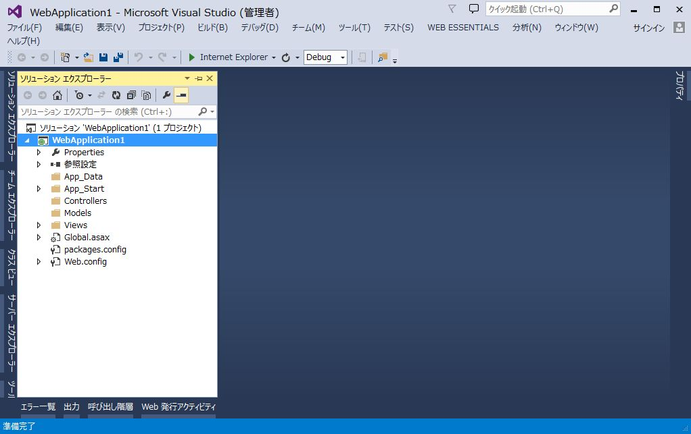

<br>

### Entity Framework のインストール

NuGetを使用して、最新の`Entity Framework`をインストールします。

<br>

------

### 用語解説: Entity Framework

> [Entity Framework](https://msdn.microsoft.com/ja-jp/data/ef.aspx)
>
> Entity Framework (EF) は、.NET 開発者がドメイン固有のオブジェクトを使用してリレーショナル データを処理できるようにするオブジェクト リレーショナル マッパーです。
> 開発者が通常、記述する必要のあるデータ アクセス コードがほとんど不要になります。

<br>

### 用語解説: O/Rマッパー

* O/Rマッピング ... オブジェクトの各プロパティを、RDBのテーブルの各フィールドに関連付けること。
* O/Rマッパー ... O/Rマッピングを行うライブラリのこと。

Microsoft謹製のものが `EntityFramework`。  
軽量で、最も利用されていると思われるのが [dapper](https://github.com/StackExchange/dapper-dot-net)。

<br>

### 用語解説: NuGet

Visual Studio用のパッケージ管理システム。
rubyのgemやpythonのpipのようなツール。

コマンドラインやPowerShellからも利用可能ですが、今回は Visual Studio が用意している GUI で操作します。

------

<br><br>

### 手順

* 「ソリューション エクスプローラー」でプロジェクト名を右クリック
* 「NuGet パッケージ マネージャー」→「ソリューションの NuGet パッケージの管理」を選択します。

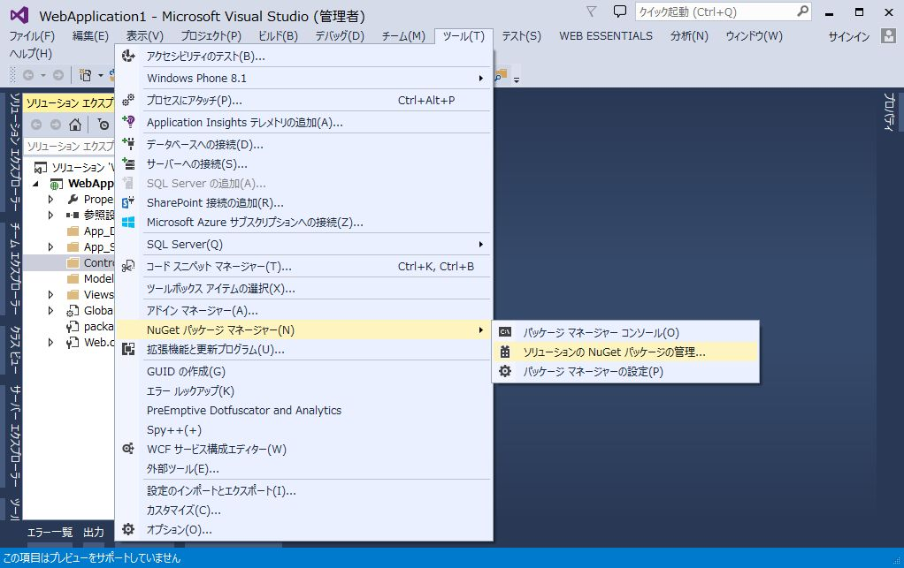

* `EntityFramework`を検索し、「インストール」をクリックします。
  - NuGetパッケージをインストールする際は、名前、作成者、バージョンを確認するようにしてください。似たような名称のパッケージが多数あります。

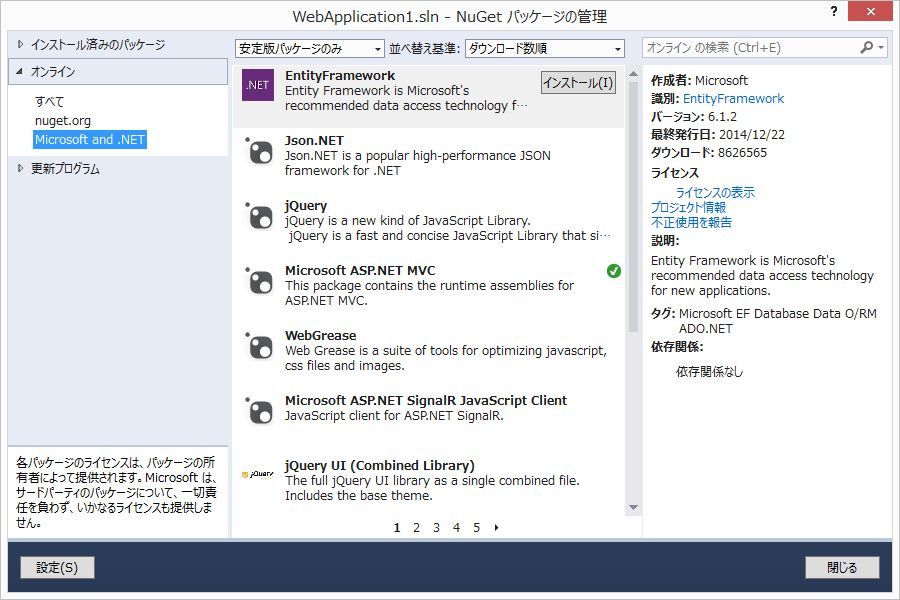

* 画面の指示に従ってインストールを進めます。
* インストール完了後、`EntityFramework`にチェックが入っている事を確認します。
* 「閉じる」をクリックします。


<br><br>

------

### 用語解説: Entity Framework の コード ファースト開発

データ構造を表現する `POCO` (Plain Old Clr Object: 特別なクラスやインターフェイスを継承していないクラス(のオブジェクト)) と
POCOを管理する Contextクラスを定義することで、Entity Frameworkが必要なテーブルを生成します。
(Databaseの操作は必要ありません。)

コード ファースト開発は `Entity Framework 4.1` から提供された機能です。

詳細については [Entity Framework (EF) の概要](http://msdn.microsoft.com/ja-jp/data/ee712907) を参照してください。

------

<br><br>

### Modelの作成

*Todoクラス* を作成していきます。

* `Models`を右クリックし、「追加」→「クラス」を選択します。

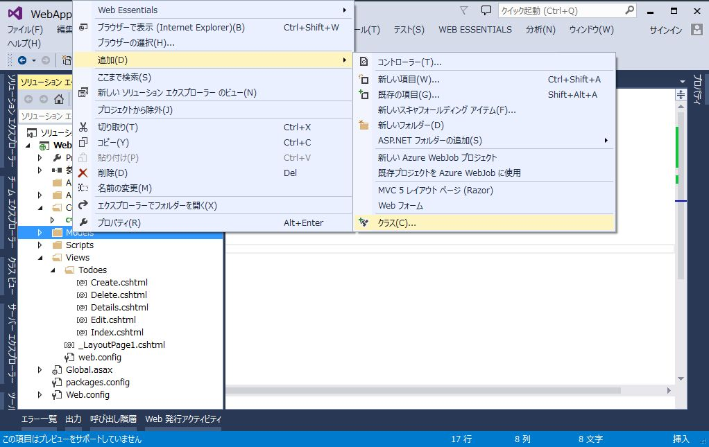

* 名前を`Todo.cs`とし、「追加」をクリックします。

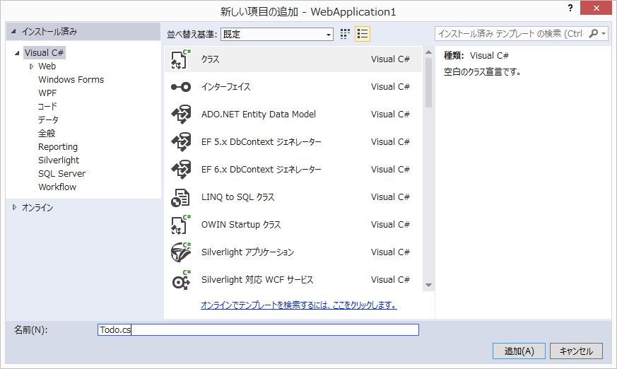

`Todo.cs`

```cs
using System;
using System.Collections.Generic;
using System.Linq;
using System.Web;
using System.ComponentModel;

namespace WebApplication1.Models
{
    /// <summary>
    /// ToDoモデル
    /// </summary>
    public class Todo
    {
        public int id { get; set; }
        [DisplayName("概要")]
        public string summary { get; set; }
        [DisplayName("詳細")]
        public string detail { get; set; }
        [DisplayName("期限")]
        public DateTime limit { get; set; }
        [DisplayName("完了")]
        public bool done { get; set; }
    }
}
```

* Todoリストの項目
  - id: Todoを一意に特定する数値。
  - summary: 概要。文字列。
  - detail: 詳細。文字列。
  - limit: 期限。日時。
  - done: 完了フラグ。真偽値。


モデルの定義にあたって抑えるポイントは以下の3点です。

* クラス名は単数形の名詞
  - 同名(複数形)のテーブルにマッピングされます。
* プロパティは同名のテーブル列にマッピングされます。
* 主キーは `id` (または`Id`) という名前がデフォルトです。
  - あるいは `<ClassName>Id` という名前でもOKです。

<br><br>

------

### 用語解説: 属性

`[DisplayName("概要")]`など、プロパティの上に記述されたカギカッコで括られた記述は
[属性(Attributes あるいは Annotation)](https://msdn.microsoft.com/ja-jp/library/z0w1kczw.aspx)と呼ばれるものです。

Viewで項目が表示される時に、`DisplayName`に設定した文言が項目名として使用されます。

`DisplayName`以外にも、 NOT NULL制約を表す `Required` や
データの最大長を示す `MaxLength` などがあります。

* 参考
  - [Code First のデータ注釈](https://msdn.microsoft.com/ja-jp/data/jj591583.aspx)
  - [System.ComponentModel.DataAnnotations 名前空間](https://msdn.microsoft.com/ja-jp/library/system.componentmodel.dataannotations.aspx)

------

<br><br>

### TodoesContextクラスの作成

Contextクラスは先ほど作成した POCO とデータベースを繋げる役割を果たします。  
データの取得、更新などの操作はすべてこのContextクラスを使用して行います。

* `Models`を右クリックし、「追加」→「クラス」を選択します。
* 名前を`TodoesContext.cs`とし、「追加」をクリックします。

`TodoesContext.cs`

```cs
using System;
using System.Collections.Generic;
using System.Data.Entity;
using System.Linq;
using System.Web;

namespace WebApplication1.Models
{
    public class TodoesContext : DbContext
    {
        public DbSet<Todo> Todoes { get; set; }
    }
}
```

Contextクラスは `DbContext`クラスを継承します。

Todoのコレクションを管理するので、`Todoes`という`DbSet<Todo>`を定義します。  
`<Todo>` は`DbSet`に格納するクラスを表します。  
`Todoes` にはデータベースから取得した `Todo` のコレクション (配列のようなもの) です。

* [DbSet<TEntity> クラス](https://msdn.microsoft.com/ja-jp/library/gg696460.aspx)

<br><br>

------

<br><br>

### Viewの作成: 共通レイアウトの作成

* `Views`を右クリックし、「追加」→「MVC 5 レイアウト ページ (Razor)」 を選択します。

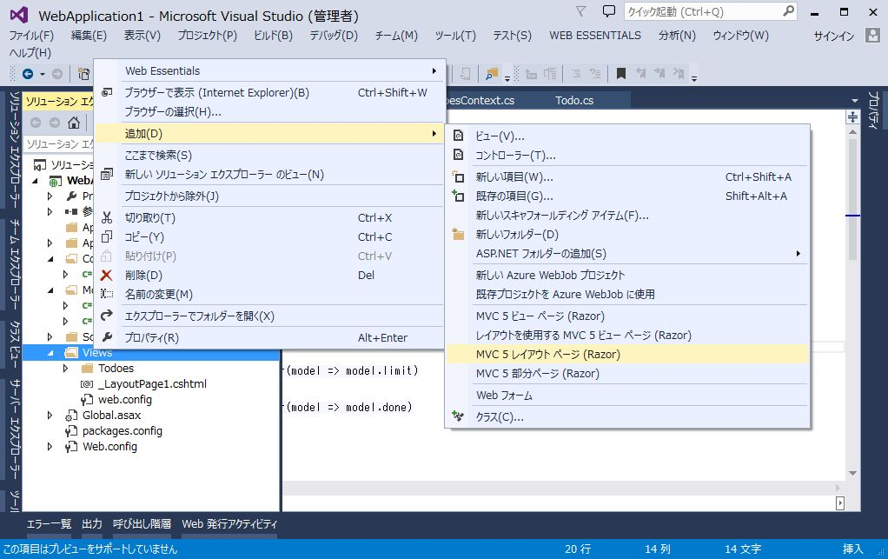

`_LayoutPage1.cshtml`

```html
<!DOCTYPE html>

<html>
<head>
    <meta charset="utf-8">
    <meta http-equiv="X-UA-Compatible" content="IE=edge">
    <meta name="viewport" content="width=device-width, initial-scale=1">

    <title>@ViewBag.Title</title>
    <link rel="stylesheet" href="https://maxcdn.bootstrapcdn.com/bootstrap/3.3.2/css/bootstrap.min.css">
</head>
<body>
    <div class="container">
        @RenderBody()
    </div>
</body>
</html>
```

`Bootstrap`を読み込むように指定します。
また、`div`に`class="container"`の指定を追加します。

`@RenderBody()` の位置に、後ほど作成する各Viewの内容がセットされます。

<br><br>

------

### 用語解説: Razor

`Razor` は HTMLにC#/VBのコードを埋め込むための仕組み (ビューエンジン) です。  
`@`で始まる箇所がサーバーサイドで実行され、クライアントに生成したHTMLが返されます。

<br>

### 用語解説: Bootstrap

> BootstrapはWebサイトやWebアプリケーションを作成するフリーソフトウェアツール集である。 タイポグラフィ、フォーム、ボタン、ナビゲーション、その他構成要素やJavaScript用拡張などがHTML及びCSSベースのデザインテンプレートとして用意されている。

[Bootstrap](http://getbootstrap.com/)

------

<br><br>

### Controllerの作成

スキャフォールディング(Scaffolding、「骨組み」「足場」という意味)によって、
Create（作成）、Read（参照）、Update（更新）、Delete（削除）のような定型的なコードの骨組みを自動生成できます。

* `Controllers`を右クリックし、「追加」→「コントローラー」を選択します。

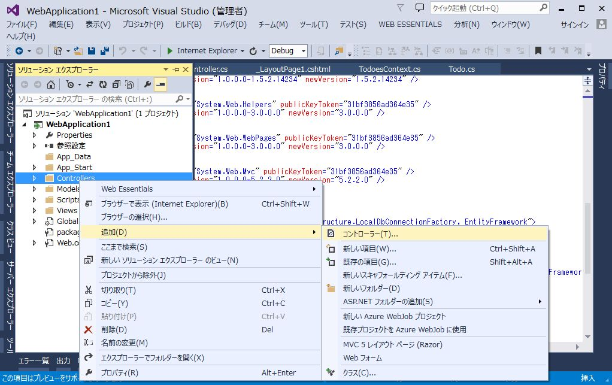

* 「Entity Framework を使用した、ビューがある MVC 5 コントローラー」を選択し、「追加」をクリックします。

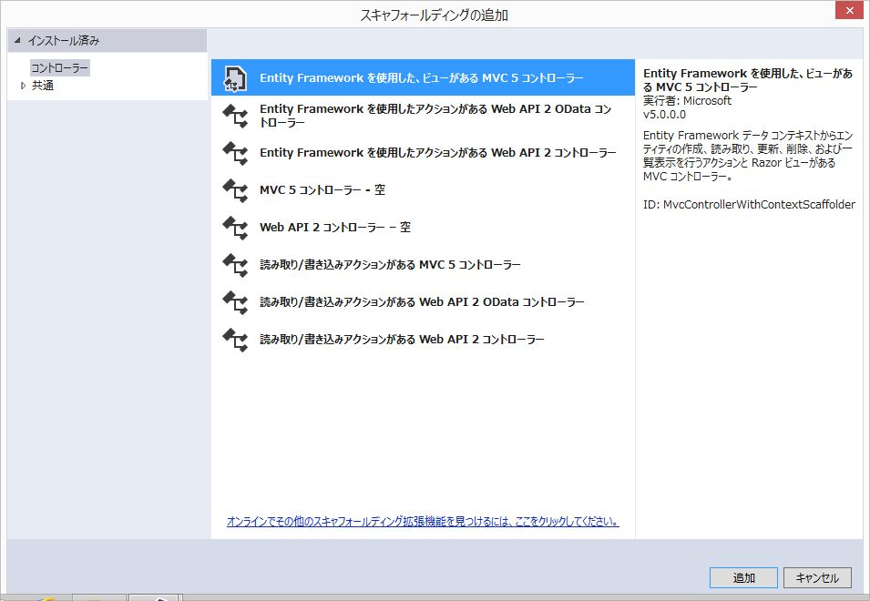

* 以下のように入力します。
  - モデル クラス: `Todo`
  - データ コンテキスト クラス: `TodoesContext`
  - レイアウトページの使用: `~/Views/_LayoutPage1.cshtml`
  - コントローラー名: `TodoesController`

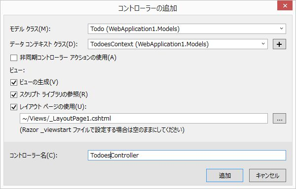


以下のファイルが生成されます。

* Controllers/
  - TodoesController.cs
* Views/Todoes/
  - Create.cshtml
  - Delete.cshtml
  - Details.cshtml
  - Edit.cshtml
  - Index.cshtml

後ほど、生成されたファイルの中身について解説します。

<br><br>

### デフォルトページの設定

`App_Start/RouteConfig.cs` を修正し、デフォルトページをToDoの一覧ページに変更します。

`routes.MapRoute`メソッドの`defaults`引数にデフォルトの設定を定義します。

```cs
using System;
using System.Collections.Generic;
using System.Linq;
using System.Web;
using System.Web.Mvc;
using System.Web.Routing;

namespace WebApplication1
{
    public class RouteConfig
    {
        public static void RegisterRoutes(RouteCollection routes)
        {
            routes.IgnoreRoute("{resource}.axd/{*pathInfo}");

            routes.MapRoute(
                name: "Default",
                url: "{controller}/{action}/{id}",
                defaults: new { controller = "Todoes", action = "Index", id = UrlParameter.Optional }
            );
        }
    }
}
```

<br><br>

------

### 用語解説: ルーティング

ルーティングとは、リクエストURIに応じて処理を受け渡し先を決定することを言います。

`ASP.NET MVC`ではクライアントからの要求を受け取ると、`RouteConfig.cs`の内容を元に
呼び出すべきコントローラー/アクションを決定します。

`routes.MapRoute`メソッドの`url`引数がルーティングの定義です。

例えば `http://localhost/Todoes/Details/3` というリクエストが来た場合、
`url`の定義にしたがって`TodoesController`の`Details`メソッドに`id=3`を引数に与えて呼び出します。

また、`defaults`でデフォルトのコントローラー、アクションを指定しているので、`http://localhost/` という
リクエストが来た場合は `http://localhost/Todoes/Index`というリクエストとして処理されます。

------

<br><br>

### デバッグ実行

F5キーを押して、デバッグ実行を行います。
ブラウザが起動し、一覧ページが表示されます。

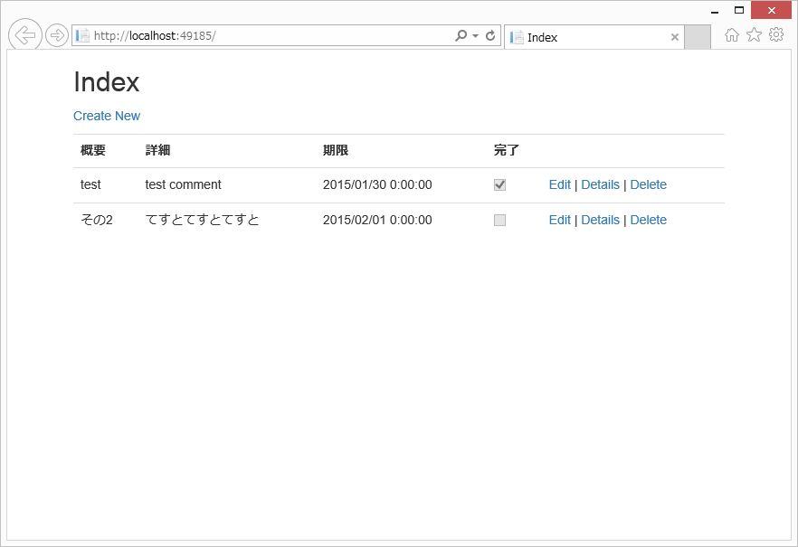

ToDoの追加、変更、削除が行えることを確認します。

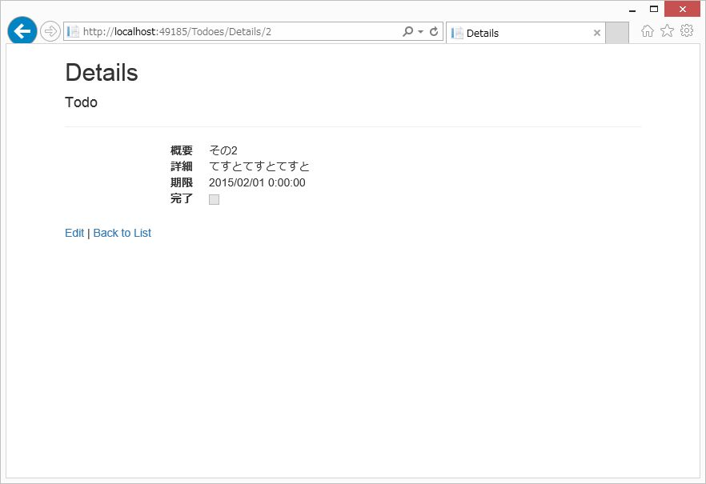

<br><br>

------

<br><br>

## ソースコード解説

### Controller

* ポイント
  - コントローラークラスの名前は必ず`Controller`で終わる必要があります。
  - コントローラーは`Controller`クラスを継承します。(Controllerクラスを継承した独自のControllerクラスでも構いません)
  - 具体的な処理を記述するのは *アクションメソッド*
  - アクションメソッドの戻り値は `ActionResult`オブジェクト

コードの細部について、順に解説します。

* [TodoesController.cs](https://github.com/Kazunori-Kimura/introduction-to-asp-dot-net/blob/master/projects/step2/WebApplication1/WebApplication1/Controllers/TodoesController.cs)

```cs
using System;
using System.Collections.Generic;
using System.Data;
using System.Data.Entity;
using System.Linq;
using System.Net;
using System.Web;
using System.Web.Mvc;
using WebApplication1.Models;

namespace WebApplication1.Controllers
{
    public class TodoesController : Controller
    {
        private TodoesContext db = new TodoesContext();
```

コントローラーのプライベート変数に Models に作成した`TodoesContext`を保持しています。

データベースへのアクセスは`TodoesContext`を介して行います。

<br><br>

```cs
        // GET: Todoes
        public ActionResult Index()
        {
            return View(db.Todoes.ToList());
        }
```

`Index`メソッドの定義です。 [View](https://msdn.microsoft.com/ja-jp/library/dd492930.aspx) メソッドは
アクションメソッドに対応した View を元に `ViewResult` ( `ActionResult` を継承した、Viewを表示するためのクラス)を返します。

`ToList()`は `Todo` の全要素を取得し、リストとして返すメソッドです。

ここでは、`views/Index.cshtml` に すべてのTodoをListに格納したオブジェクトを渡して生成される結果を返しています。

<br><br>

------

### 用語解説: ActionResult

アクションメソッドは、戻り値となる `ActionResult` の派生オブジェクトを介してアクションの結果 (その後に行うべき挙動) を通知します。

代表的なActionResultの派生クラスは以下の通りです。

<table class="table">
  <thead>
    <tr>
      <th>クラス名</th>
      <th>ヘルパーメソッド</th>
      <th>概要</th>
    </tr>
  </thead>
  <tbody>
    <tr>
      <td>ViewResult</td>
      <td>View</td>
      <td>アクションメソッドに対応したViewを出力</td>
    </tr>
    <tr>
      <td>RedirectToRouteResult</td>
      <td>RedirectToAction</td>
      <td>指定のアクションメソッドに処理を転送</td>
    </tr>
    <tr>
      <td>ContentResult</td>
      <td>Content</td>
      <td>指定されたテキストを出力</td>
    </tr>
    <tr>
      <td>FileContentResult</td>
      <td>File</td>
      <td>指定されたファイルを出力</td>
    </tr>
    <tr>
      <td>JsonResult</td>
      <td>Json</td>
      <td>指定されたオブジェクトをJSON形式で出力</td>
    </tr>
    <tr>
      <td>HttpNotFoundResult</td>
      <td>HttpNotFound</td>
      <td>404ページを出力</td>
    </tr>
    <tr>
      <td>EmptyResult</td>
      <td>-</td>
      <td>なにも行わない</td>
    </tr>
  </tbody>
</table>

------

<br><br>


```cs
        // GET: Todoes/Details/5
        public ActionResult Details(int? id)
        {
            if (id == null)
            {
                return new HttpStatusCodeResult(HttpStatusCode.BadRequest);
            }
            Todo todo = db.Todoes.Find(id);
            if (todo == null)
            {
                return HttpNotFound();
            }
            return View(todo);
        }
```

`Details`メソッドの定義です。

`int?` は `int` の *Nullable型* です。  
通常の `int` は `null` を設定できませんが、Nullable型は `null` が許容されます。

`RouteConfig.cs` の `defaults` の定義により、`id`は省略可能です。  
`id` が省略された場合、`Details`の引数 `id` には `null` が設定されます。

`id` が `null` の場合は要求されたURLが正しくないので、
`BadRequest`を返しています。

`Todo todo = db.Todoes.Find(id);` はデータベースから `id` が一致するデータをひとつ取り出します。

一致するデータが存在しない場合は `Find` から `null` が返ってくるので、
`NotFound`を返しています。

一致するデータが存在すれば、それを`View`にセットして返します。

<br><br>

```cs
        // GET: Todoes/Create
        public ActionResult Create()
        {
            return View();
        }
```

新規登録時は `View` を表示するだけです。

<br><br>

```cs
        // POST: Todoes/Create
        // 過多ポスティング攻撃を防止するには、バインド先とする特定のプロパティを有効にしてください。
        // 詳細については、http://go.microsoft.com/fwlink/?LinkId=317598 を参照してください。
        [HttpPost]
        [ValidateAntiForgeryToken]
        public ActionResult Create([Bind(Include = "id,summary,detail,limit,done")] Todo todo)
        {
            if (ModelState.IsValid)
            {
                db.Todoes.Add(todo);
                db.SaveChanges();
                return RedirectToAction("Index");
            }

            return View(todo);
        }
```

`[HttpPost]`は `http` の `POST`メソッドでリクエストがあった場合に呼び出されるアクションメソッドを表す属性です。

`ValidateAntiForgeryToken` は *クロスサイト・リクエスト・フォージェリ攻撃* を防ぐための記述です。

<br><br>

------

### 用語解説: クロスサイトリクエストフォージェリ (CSRF)

> クロスサイトリクエストフォージェリ（Cross site request forgeries、略記：CSRF、またはXSRF）は、WWW における攻撃手法のひとつである。 具体的な被害としては、掲示板に意図しない書き込みをさせられたり、オンラインショップで買い物をさせられたりするなどが挙げられる。
> [クロスサイトリクエストフォージェリ](https://ja.wikipedia.org/wiki/%E3%82%AF%E3%83%AD%E3%82%B9%E3%82%B5%E3%82%A4%E3%83%88%E3%83%AA%E3%82%AF%E3%82%A8%E3%82%B9%E3%83%88%E3%83%95%E3%82%A9%E3%83%BC%E3%82%B8%E3%82%A7%E3%83%AA)

------

<br><br>

[Bind](https://msdn.microsoft.com/ja-jp/library/system.web.mvc.bindattribute.aspx) は POSTされたデータを
`Todo`モデルに紐付けます。

`ModelState.IsValid` は入力チェックがOKかどうかを判定します。  
例えば、`DateTime`型の `limit`に日付以外の値がセットされている場合は `IsValid` が `false`となるため
登録処理が行われません。

更新処理の中身はそのままの意味ですが、

- `Add` でPOSTされたデータを `DbSet` に登録し
- `SaveChanges` で `DbSet` の変更をデータベースに反映します。
- `RedirectToAction` は 指定されたアクションメソッドに転送します。

<br><br>

------

### モデルバインド と 過多ポスティング攻撃について

ASP.NET MVCでは、クライアントからの入力値を自動的にモデルに割り当てる *モデルバインド* という機能があります。  
上記の `Create` は以下のように書くこともできます。

```cs
[HttpPost]
[ValidateAntiForgeryToken]
public ActionResult Create(Todo todo)
```

こうすることで、クライアントからPOSTされてきたデータのkey名を見てモデルに自動的に割り当ててくれるのですが、
上記の記述ではセキュリティホールの原因となる場合もあります。

例えば、以下の様な `Account`クラスがあった場合を考えます。

```cs
public class Account
{
  public int id { get; set; }
  public string mail { get; set; }
  public string password { get; set; }
  public int role { get; set; }
}
```

ここで、 `role`(権限) は管理者のみが設定でき、エンドユーザーからは勝手に編集できないものとします。
(以下の様なViewのイメージ)

```html
@using (Html.BeginForm())
{
  @Html.HiddenFor(model => model.id)
  @Html.EditorFor(model => model.mail)
  @Html.EditorFor(model => model.password)
}
```

しかし、悪意あるユーザーがPOSTデータを改ざんし、role値を含んだデータを送信すると、
`Create`メソッドはその値をモデルに割り当ててしまい、結果、意図せず `role`に値が設定されてしまいます。

このような攻撃を *過多ポスティング攻撃* といいます。

自動生成された `Create` メソッドのように `Bind` を使用して
モデルバインドするプロパティを明示することにより、過多ポスティング攻撃を防止しています。

------

<br><br>

```cs
        // GET: Todoes/Edit/5
        public ActionResult Edit(int? id)
        {
            if (id == null)
            {
                return new HttpStatusCodeResult(HttpStatusCode.BadRequest);
            }
            Todo todo = db.Todoes.Find(id);
            if (todo == null)
            {
                return HttpNotFound();
            }
            return View(todo);
        }

        // POST: Todoes/Edit/5
        // 過多ポスティング攻撃を防止するには、バインド先とする特定のプロパティを有効にしてください。
        // 詳細については、http://go.microsoft.com/fwlink/?LinkId=317598 を参照してください。
        [HttpPost]
        [ValidateAntiForgeryToken]
        public ActionResult Edit([Bind(Include = "id,summary,detail,limit,done")] Todo todo)
        {
            if (ModelState.IsValid)
            {
                db.Entry(todo).State = EntityState.Modified;
                db.SaveChanges();
                return RedirectToAction("Index");
            }
            return View(todo);
        }
```

`Edit`メソッドは `Details` と `Create` の処理を組み合わせた内容です。

<br><br>

```cs
        // GET: Todoes/Delete/5
        public ActionResult Delete(int? id)
        {
            if (id == null)
            {
                return new HttpStatusCodeResult(HttpStatusCode.BadRequest);
            }
            Todo todo = db.Todoes.Find(id);
            if (todo == null)
            {
                return HttpNotFound();
            }
            return View(todo);
        }

        // POST: Todoes/Delete/5
        [HttpPost, ActionName("Delete")]
        [ValidateAntiForgeryToken]
        public ActionResult DeleteConfirmed(int id)
        {
            Todo todo = db.Todoes.Find(id);
            db.Todoes.Remove(todo);
            db.SaveChanges();
            return RedirectToAction("Index");
        }
```

削除時の流れは以下のようになります。

* `Delete/{id}` にリクエスト (Get)
  - `Delete` メソッドから `Delete.cshtml` が返される
* `Delete` ボタンをクリック -> `Delete` にPOSTされる
  - 該当IDの項目を検索し削除
  - `Index` を返す

<br><br>

```cs
        protected override void Dispose(bool disposing)
        {
            if (disposing)
            {
                db.Dispose();
            }
            base.Dispose(disposing);
        }
    }
}
```

`Dispose` は終了処理です。
`db.Dispose()` で保持している `Context` を開放しています。

<br><br>

------

<br><br>

##### View

まず、`Index.cshtml` の内容について順に解説していきます。

* [Index.cshtml](https://github.com/Kazunori-Kimura/introduction-to-asp-dot-net/blob/master/projects/step2/WebApplication1/WebApplication1/Views/Todoes/Index.cshtml)


```html
@model IEnumerable<WebApplication1.Models.Todo>
```

コントローラーのアクションメソッドにて `View(db.Todoes.ToList())` で引き渡されたデータを受け取るには、
`@modelディレクティブ` を使用します。  
`IEnumerable<WebApplication1.Models.Todo>` は `Todo`クラスのリストを表します。


`@`から始まる文はRazorの *コードナゲット* としてサーバーサイドで処理されます。

HTML内にRazorの式としてではなく、`@`をそのまま表示したい場合は
`@@` とすることでエスケープして表示されます。

また、コメントを記載する場合は `@* ... *@` と記述します。  
HTMLのコメントと異なり、サーバーサイドでコメントとして処理されるため、ブラウザでソースを表示しても
`@* ... *@` は出力されません。

<br><br>

```html
@{
    ViewBag.Title = "Index";
    Layout = "~/Views/_LayoutPage1.cshtml";
}
```

`@{ ... }` の中にC#のコードを書くと、サーバーサイドで実行されます。  
ここでは `Title` の設定とレイアウトの指定をしています。

`ViewBag`はコントローラとビューの間でデータをやりとりする際に使用します。

* [WebViewPage.ViewBagプロパティ](https://msdn.microsoft.com/ja-jp/library/gg512039.aspx)

<br><br>

```html
<h2>Index</h2>

<p>
    @Html.ActionLink("Create New", "Create")
</p>
```

`@Html`から始まるメソッドは *HTMLヘルパー* と呼ばれ、HTMLの生成をカプセル化します。


`@Html.ActionLink()` はリンクを生成します。  
上記の場合は `TodoesController`の`Create`アクションへのリンクが生成されます。

<br><br>

```html
<table class="table">
    <tr>
        <th>
            @Html.DisplayNameFor(model => model.summary)
        </th>
        <th>
            @Html.DisplayNameFor(model => model.detail)
        </th>
        <th>
            @Html.DisplayNameFor(model => model.limit)
        </th>
        <th>
            @Html.DisplayNameFor(model => model.done)
        </th>
        <th></th>
    </tr>
```

`@Html.DisplayNameFor()` はモデルの定義に応じて、プロパティの表示名を表示します。

`<label>`タグとして出力したい場合は`@Html.LabelFor()`を使用すると、表示名をラベルに整形して出力します。

<br><br>

```html
@foreach (var item in Model) {
    <tr>
        <td>
            @Html.DisplayFor(modelItem => item.summary)
        </td>
        <td>
            @Html.DisplayFor(modelItem => item.detail)
        </td>
        <td>
            @Html.DisplayFor(modelItem => item.limit)
        </td>
        <td>
            @Html.DisplayFor(modelItem => item.done)
        </td>
        <td>
            @Html.ActionLink("Edit", "Edit", new { id=item.id }) |
            @Html.ActionLink("Details", "Details", new { id=item.id }) |
            @Html.ActionLink("Delete", "Delete", new { id=item.id })
        </td>
    </tr>
}

</table>
```

制御構文内は自動的にコードブロックとして認識されます。
`foreach` だけでなく、`if` や `switch` などC#の制御構文がそのまま使用できます。

`@Html.DisplayFor()` はモデル定義に応じて出力される内容が変わります。

* string型であればそのまま文字列が表示されます。
* bool型であれば、チェックボックスが表示され、trueの場合はチェックがONとなります。

`DisplayFor`はプロパティの内容を表示するだけなので、チェックボックスはreadonlyとなります。

<br><br>

------

<br><br>

つづいて、編集画面の例として `Edit.cshtml` の解説をしていきます。

*  [Edit.cshtml](https://github.com/Kazunori-Kimura/introduction-to-asp-dot-net/blob/master/projects/step2/WebApplication1/WebApplication1/Views/Todoes/Edit.cshtml)

```html
@model WebApplication1.Models.Todo

@{
    ViewBag.Title = "Edit";
    Layout = "~/Views/_LayoutPage1.cshtml";
}

<h2>Edit</h2>
```

ここまでは `Index.cshtml` と同様です。

コントローラでは 1つの項目を取得して Viewにセットされてきますので、
`@model` では単純に `Todo`モデルを受け取るように指定しています。

<br><br>

```html
@using (Html.BeginForm())
{
    @Html.AntiForgeryToken()
```

`@using (Html.BeginForm()) { ... }` はブロック内を `<form>` で括ります。

`@Html.AntiForgeryToken()` は CSRF対策の `<hidden>` タグを埋め込みます。

<br><br>

```html
    <div class="form-horizontal">
        <h4>Todo</h4>
        <hr />
        @Html.ValidationSummary(true, "", new { @class = "text-danger" })
        @Html.HiddenFor(model => model.id)

        <div class="form-group">
            @Html.LabelFor(model => model.summary, htmlAttributes: new { @class = "control-label col-md-2" })
            <div class="col-md-10">
                @Html.EditorFor(model => model.summary, new { htmlAttributes = new { @class = "form-control" } })
                @Html.ValidationMessageFor(model => model.summary, "", new { @class = "text-danger" })
            </div>
        </div>

        <div class="form-group">
            @Html.LabelFor(model => model.detail, htmlAttributes: new { @class = "control-label col-md-2" })
            <div class="col-md-10">
                @Html.EditorFor(model => model.detail, new { htmlAttributes = new { @class = "form-control" } })
                @Html.ValidationMessageFor(model => model.detail, "", new { @class = "text-danger" })
            </div>
        </div>

        <div class="form-group">
            @Html.LabelFor(model => model.limit, htmlAttributes: new { @class = "control-label col-md-2" })
            <div class="col-md-10">
                @Html.EditorFor(model => model.limit, new { htmlAttributes = new { @class = "form-control" } })
                @Html.ValidationMessageFor(model => model.limit, "", new { @class = "text-danger" })
            </div>
        </div>

        <div class="form-group">
            @Html.LabelFor(model => model.done, htmlAttributes: new { @class = "control-label col-md-2" })
            <div class="col-md-10">
                <div class="checkbox">
                    @Html.EditorFor(model => model.done)
                    @Html.ValidationMessageFor(model => model.done, "", new { @class = "text-danger" })
                </div>
            </div>
        </div>

        <div class="form-group">
            <div class="col-md-offset-2 col-md-10">
                <input type="submit" value="Save" class="btn btn-default" />
            </div>
        </div>
    </div>
}
```

HTMLヘルパーで入力フォームを生成しています。

* `@Html.ValidationSummary()`: 入力検証(validation)の結果で返されるメッセージが入ります。
* `@Html.HiddenFor()`: `hidden`タグを生成します。
* `@Html.LabelFor()`: `label`タグを生成します。
* `@Html.EditorFor()`: モデル定義に応じたタグを生成します。
* `@Html.ValidationMessageFor()`: 各エディタでのvalidationのエラーメッセージが表示されます。

<br><br>

```html
<div>
    @Html.ActionLink("Back to List", "Index")
</div>

<script src="~/Scripts/jquery-1.10.2.min.js"></script>
<script src="~/Scripts/jquery.validate.min.js"></script>
<script src="~/Scripts/jquery.validate.unobtrusive.min.js"></script>
```

最後に `jQuery`の読み込みを行っています。  
これらのJavaScriptはvalidationで使用されています。

<br><br>

------

<br>
<br>

`ASP.NET MVC 5` と `Entity Framework 6` を活用して、非常にシンプルなWebアプリケーションを、簡単・簡潔に作成する手順について解説しました。

ほとんどコーディングを行わずに、基本的な CRUD を行うアプリケーションが作成できることに驚かれたと思います。

また、デバッグ実行したブラウザで `F12` キーを押し、開発者ツールを起動すると分かりますが
生成されるHTMLは見通しがよく、`JavaScript`や`CSS`での操作が容易です。

生成されるViewは`Bootstrap`や`jQuery`を使用することを想定した作りになっていますので
特別な対応を行わなくても、ある程度見栄えのするアプリケーションが作成できます。
