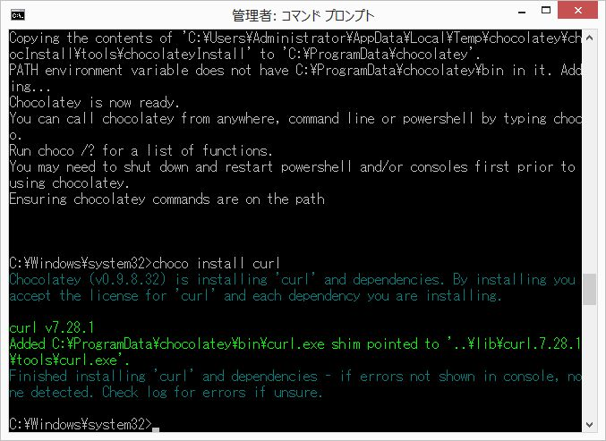
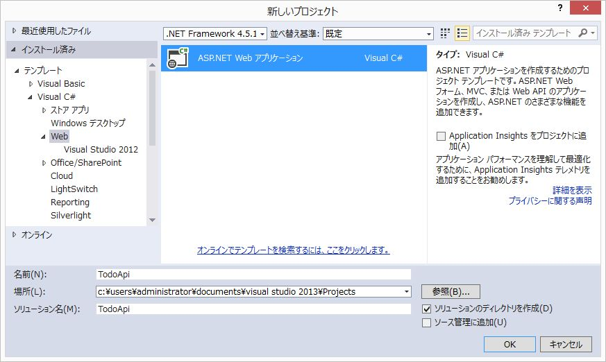
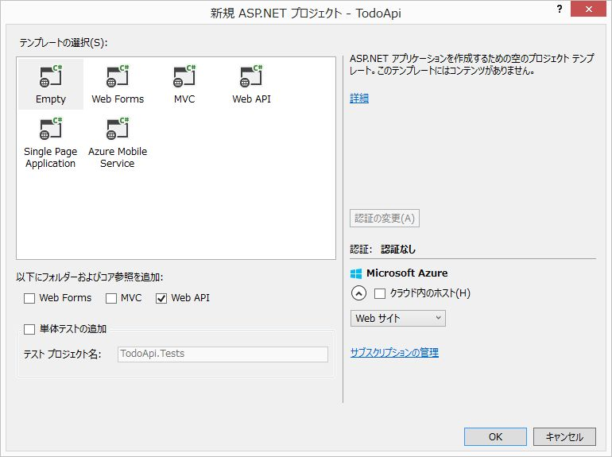
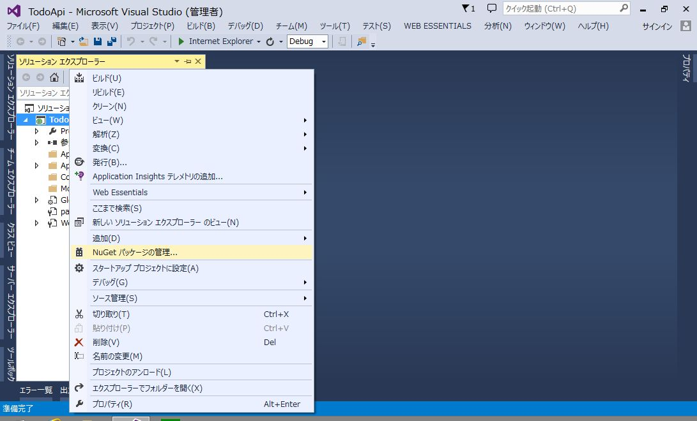
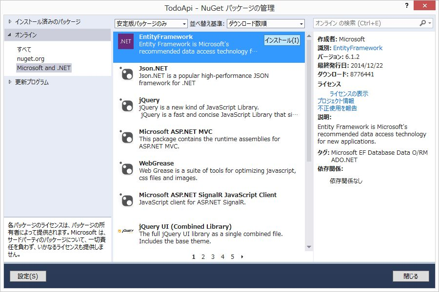
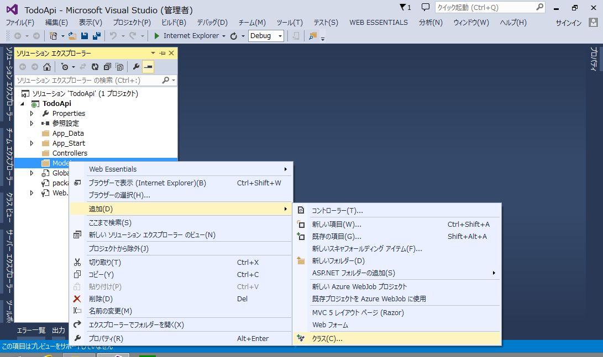
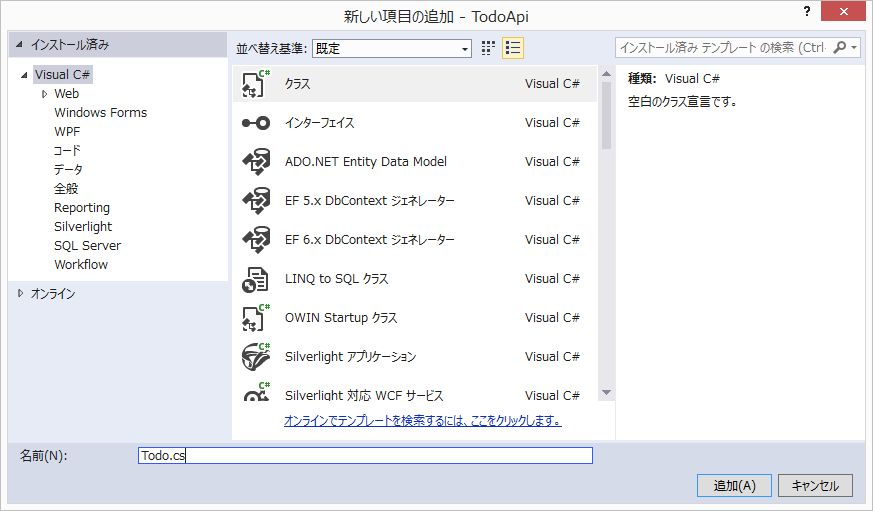
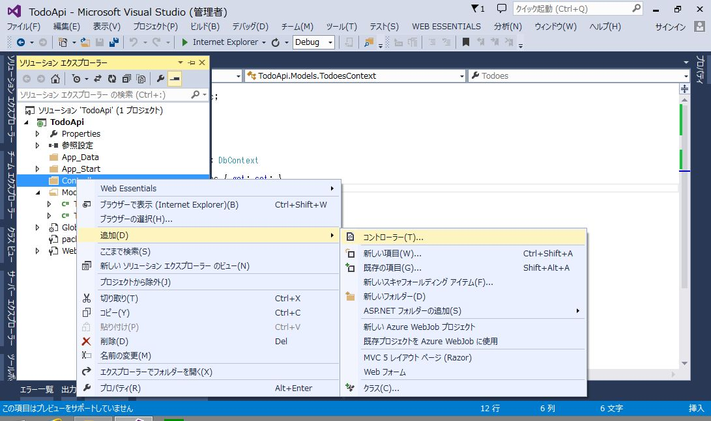
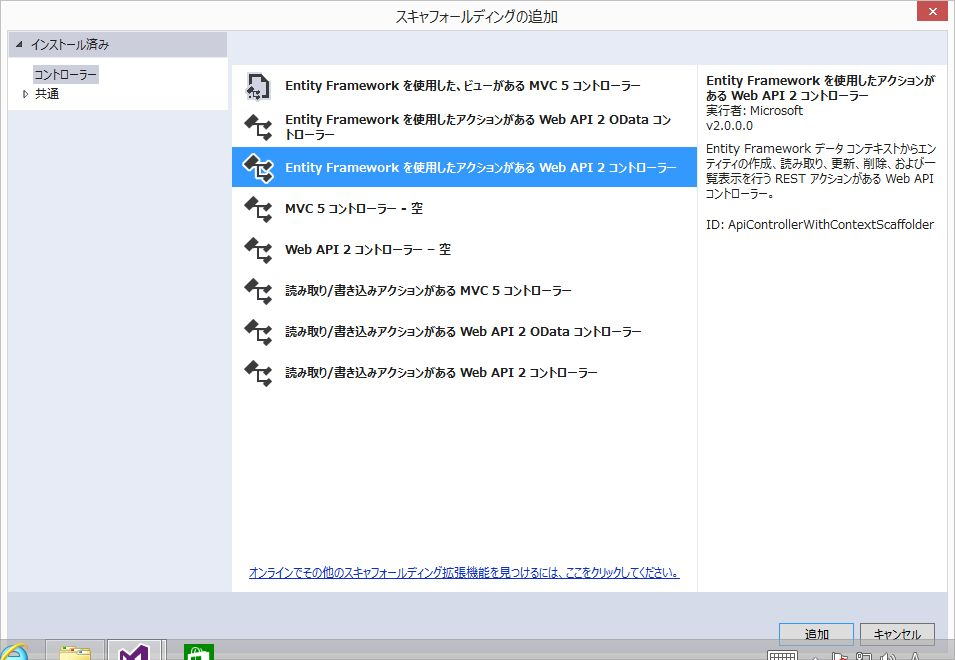
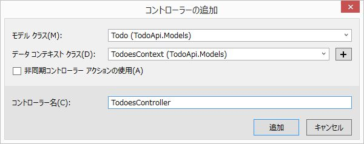

# 4. `ASP.NET Web API`によるREST API開発

## Web API とは？

* `API`: Application Programming Interface
  - あるプログラムが提供する機能を、 *外部の別のプログラム* から呼び出して利用するための手法


プログラムからのHTTPリクエストに対し、`XML` や `JSON` などのデータを返すWebアプリケーションを *Web API* と呼びます。

<br>

### Web API のメリットは？

* HTTP が使用できるものであれば、どのようなクライアントからも利用できる
  - Webブラウザ向けのシステムをモバイル向けに作り直す、といった時も Web API は変更しなくてよい
  - 複数のWeb APIを組み合わせたシステムを開発することも可能 (マッシュアップ)
* クライアントサイドのプログラムと完全に分断して開発できる
  - システムの役割が明確になり、より良い設計になる (ことが期待できる)

<br>

## `REST` とは？

* Web API のソフトウェアアーキテクチャのスタイルのひとつ。
  - REST の原則に従っているシステムは `RESTful`なシステム、 といわれます。
  - REST をとても熱心に支持する *RESTafarians* と呼ばれる人たちがいます。  
このような人たちに、適当な設計のWebアプリケーションを「REST APIです」と紹介すると、すごいマサカリが飛んできます。


### 原則

* ステートレスなクライアント/サーバープロトコル

セッションやクッキーによるセッション状態の管理を行わず、
一度のリクエスト/レスポンスで問い合わせが完了する。


* `URI (Uniform Resource Identifier)` でリソースを一意に識別する

`http://{webapi}/user/1/task/5` のような URL にリクエストを投げると
`userId`が`1`のユーザーが持っている`taskId`が`5`のタスク情報を返すようなイメージ。


* HTTPメソッドでリソースを操作する

| HTTPメソッド | リソースの操作 |
| ------ | ------------------ |
| GET    | リソースの取得 (Read)   |
| POST   | リソースの追加 (Create) |
| PUT    | リソースの更新 (Update) |
| DELETE | リソースの削除 (Delete) |


* 操作の結果は HTTPのステータスコードで返す

| ステータスコード | 意味 |
| --- | ---------- |
| 200 | OK         |
| 201 | Created    |
| 400 | Bad Request |
| 401 | Unauthorized |
| 403 | Forbidden   |
| 404 | Not Found   |
| 500 | Internal Server Error |


<br>

------

<br>

## Getting Started with ASP.NET Web API

参考: [Getting Started with ASP.NET Web API 2](http://www.asp.net/web-api/overview/getting-started-with-aspnet-web-api/tutorial-your-first-web-api)

<br>

### クライアント環境のインストール

今回はクライアント側のプログラムは作成しないので、Web APIに問い合わせを行う
クライアントアプリケーションを用意します。

HTTPが喋れるツールであれば何でも良いのですが、今回は `cURL` を使用します。


#### cURL

> cURL（カール）は、さまざまなプロトコルを用いてデータを転送するライブラリとコマンドラインツールを提供するプロジェクトである。
>
> [cURL](http://ja.wikipedia.org/wiki/CURL)


#### Chocolatey

自分で`cURL`のバイナリを探してきてダウンロード・インストールするのは面倒臭いので、
パッケージ管理ツールを使用します。

[Chocolatey](https://chocolatey.org/) は `apt-get` のようなパッケージ管理ツールです。
(`Chocolatey` の背後では NuGet が動いているようです。)

コマンドプロンプトを `管理者として実行` し、以下のコマンドをコピー&ペーストします。

```bat
@powershell -NoProfile -ExecutionPolicy unrestricted -Command "iex ((new-object net.webclient).DownloadString('https://chocolatey.org/install.ps1'))" && SET PATH=%PATH%;%ALLUSERSPROFILE%\chocolatey\bin
```

#### cURLのインストール

`Chocolatey` を使用して、`cURL`をインストールします。

```bat
choco install curl
```



#### 動作確認

`www.example.com`のhtmlを取得してみます。

```bat
>curl http://www.example.com
<!doctype html>
<html>
<head>
    <title>Example Domain</title>

    <meta charset="utf-8" />
    :
```

きちんとhtmlが返ってくれば、準備完了です。

<br>

------

<br>

### 作成するWeb APIの仕様

* ToDo管理API

| 操作 | URL | Method | 説明 |
| ---- | ---- | ---- | ---- |
| Create | /api/Todoes/ | post | 1件作成 |
| Read | /api/Todoes/{id} | get | 指定したTodoを取得 |
| ReadAll | /api/Todoes/ | get | 全てのTodoを取得 |
| Update | /api/Todoes/{id} | put | 指定したTodoを更新 |
| Delete | /api/Todoes/{id} | delete | 指定したTodoを削除 |


#### Todoリストの項目

* id: Todoを一意に特定する数値。
* summary: 概要。文字列。
* detail: 詳細。文字列。
* limit: 期限。日時。
* done: 完了フラグ。真偽値。

    前回作成した MVC の Todo管理アプリケーションと同じ内容です。

------

### 開発手順

#### プロジェクトの作成

* 新しいプロジェクトの作成
  - 名前は `TodoApi` とします。



* テンプレートは `Empty`を選択し、`Web API`にチェックを入れます。



<br>

#### EntityFrameworkを追加

* プロジェクトを右クリック→「NuGet パッケージの管理」



* EntityFrameworkを選択して「インストール」



<br>

#### Modelクラスの追加

* `Models`を右クリック→「追加」→「クラス」を選択



* 名前を `Todo.cs` として「追加」



`Todo.cs`

```cs
using System;
using System.Collections.Generic;
using System.Linq;
using System.Web;

namespace TodoApi.Models
{
    public class Todo
    {
        public int id { get; set; }
        public string summary { get; set; }
        public string detail { get; set; }
        public DateTime limit { get; set; }
        public bool done { get; set; }
    }
}
```

* 続いて `TodoesContext.cs` を追加

`TodoesContext.cs`

```cs
using System;
using System.Collections.Generic;
using System.Data.Entity;
using System.Linq;
using System.Web;

namespace TodoApi.Models
{
    public class TodoesContext : DbContext
    {
        public DbSet<Todo> Todoes { get; set; }
    }
}
```

ここまで作成したら、一旦ソリューション全体をビルドする。

<br>

#### Controllerクラスの追加

* Controllersを右クリック→「追加」→「コントローラー」を選択



* `Entity Framework を使用したアクションがある Web API 2 コントローラー` を選択して「追加」をクリック



* モデル クラスに `Todo`、データ コンテキスト クラスに `TodoesContext` を選択して「追加」をクリック
  - コントローラー名は自動で `TodoesController` となるはず
  - Model 作成時にビルドを実行していない場合、ここでエラーが発生します。



* 以下の様なコードが自動生成されます。

`TodoesController.cs`

```cs
using System;
using System.Collections.Generic;
using System.Data;
using System.Data.Entity;
using System.Data.Entity.Infrastructure;
using System.Linq;
using System.Net;
using System.Net.Http;
using System.Web.Http;
using System.Web.Http.Description;
using TodoApi.Models;

namespace TodoApi.Controllers
{
    public class TodoesController : ApiController
    {
        private TodoesContext db = new TodoesContext();

        // GET: api/Todoes
        public IQueryable<Todo> GetTodoes()
        {
            return db.Todoes;
        }

        // GET: api/Todoes/5
        [ResponseType(typeof(Todo))]
        public IHttpActionResult GetTodo(int id)
        {
            Todo todo = db.Todoes.Find(id);
            if (todo == null)
            {
                return NotFound();
            }

            return Ok(todo);
        }

        // PUT: api/Todoes/5
        [ResponseType(typeof(void))]
        public IHttpActionResult PutTodo(int id, Todo todo)
        {
            if (!ModelState.IsValid)
            {
                return BadRequest(ModelState);
            }

            if (id != todo.id)
            {
                return BadRequest();
            }

            db.Entry(todo).State = EntityState.Modified;

            try
            {
                db.SaveChanges();
            }
            catch (DbUpdateConcurrencyException)
            {
                if (!TodoExists(id))
                {
                    return NotFound();
                }
                else
                {
                    throw;
                }
            }

            return StatusCode(HttpStatusCode.NoContent);
        }

        // POST: api/Todoes
        [ResponseType(typeof(Todo))]
        public IHttpActionResult PostTodo(Todo todo)
        {
            if (!ModelState.IsValid)
            {
                return BadRequest(ModelState);
            }

            db.Todoes.Add(todo);
            db.SaveChanges();

            return CreatedAtRoute("DefaultApi", new { id = todo.id }, todo);
        }

        // DELETE: api/Todoes/5
        [ResponseType(typeof(Todo))]
        public IHttpActionResult DeleteTodo(int id)
        {
            Todo todo = db.Todoes.Find(id);
            if (todo == null)
            {
                return NotFound();
            }

            db.Todoes.Remove(todo);
            db.SaveChanges();

            return Ok(todo);
        }

        protected override void Dispose(bool disposing)
        {
            if (disposing)
            {
                db.Dispose();
            }
            base.Dispose(disposing);
        }

        private bool TodoExists(int id)
        {
            return db.Todoes.Count(e => e.id == id) > 0;
        }
    }
}
```

Web APIとして公開されるメソッドは `Public` になっています。

また、それぞれの命名規則は `HTTPメソッド名 + Model名` となっています。


#### 動作確認

Visual Studioで F5キーを押下 (あるいは `|>`ボタンをクリック) してデバッグ実行します。

ブラウザが起動しますが、Webページは用意していないのでエラー画面が表示されると思います。
Web API は正常に稼働しているはずです。 (動作確認を完了するまでブラウザは終了せず、そのままにしておいてください。)

* curlコマンドを使用して、Web APIにリクエストを投げます。

```sh
# get all items
curl http://localhost:49192/api/Todoes/

# create item
curl -v -H "Content-Type: application/json" -H "Accept:application/json" -X POST -d "{\"summary\":\"test\",\"detail\":\"hogehoge\",\"limit\":\"2015-02-01\",\"done\":\"false\"}" http://localhost:49192/api/Todoes/

# get item
curl http://localhost:49192/api/Todoes/1

# update item
curl -v -H "Content-Type: application/json" -H "Accept:application/json" -X PUT -d "{\"id\":5,\"summary\":\"test2\",\"detail\":\"hogehoge\",\"limit\":\"2015-02-01\",\"done\":\"false\"}" http://localhost:49192/api/Todoes/5
```

### 補足(1) 絞り込み機能の追加

現状、`http://localhost:49192/api/Todoes/` にリクエストを投げると全件返ってきます。

URLにパラメータ (`QueryString`といいます) を付与することで、Todoを絞り込めるように機能を追加してみます。


`GetTodoes`を拡張し、引数にパラメータを取得するように指定します。

```cs
// GET: api/Todoes
public IQueryable<Todo> GetTodoes([FromUri] Todo param)
{
    var todoes = db.Todoes.OrderBy(item => item.id).Select(item => item);

    if (!string.IsNullOrEmpty(param.summary))
    {
        // summary検索
        todoes = todoes.Where(item => item.summary.Contains(param.summary));
    }
    if (param.done)
    {
        // 完了フラグ
        todoes = todoes.Where(item => true.Equals(item.done));
    }

    return todoes;
}
```

* `[FromUri]` は `QueryString`の内容を引数にセットする指定です。

* `Select`, `OrderBy`, `Where` は `クエリ ビルダー メソッド` と言われるメソッドで `DbSet` (ここでは `db.Todoes`) のデータをフィルタリングしたり、並べ替えたりする際に使用します。
  - [データをフィルター選択する方法 (Entity Framework)](https://msdn.microsoft.com/ja-jp/library/cc716755(v=vs.100).aspx)


`http://localhost:49192/api/Todoes/?summary=test&done=false` といったようにURLパラメータに絞り込み条件を付与すると、条件に一致した項目のみ返ってきます。

<br>

### 補足(2) データの格納場所について

これまでの処理で登録されたデータは、`SQL Server LocalDB` に保存されています。

以下の手順で、登録されたデータを確認することができます。

* `Web.config` に登録されている LocalDB のインスタンス名を確認します。

```xml
  :
  <entityFramework>
    <defaultConnectionFactory type="System.Data.Entity.Infrastructure.LocalDbConnectionFactory, EntityFramework">
      <parameters>
        <parameter value="mssqllocaldb" />
      </parameters>
    </defaultConnectionFactory>
    <providers>
      <provider invariantName="System.Data.SqlClient" type="System.Data.Entity.SqlServer.SqlProviderServices, EntityFramework.SqlServer" />
    </providers>
  </entityFramework>
```

* `mssqllocaldb` がインスタンス名です。
* Visual Studio にて `表示` > `SQL Server オブジェクト エクスプローラー` を選択します。
* `SQL Serverの追加` をクリックします。
* サーバー名に `(localdb)\mssqllocaldb` と入力し、接続します。
* 「データベース」フォルダに `TodoApi.Models.TodoesContext` というデータベースが存在します。
  - `テーブル > dbo.Todoes` を右クリックし、「データの表示」を選択します。

正常に接続できない場合は、以下の手順でインスタンス名を確認します。

* コマンドプロンプトを起動します。
* `>sqllocaldb i` と入力します。
  - インスタンスの一覧が表示されます。
  - `SQL Server オブジェクト エクスプローラー` で各インスタンスの中身を確認してください。


<br>
<br>

------

<br>

ASP.NET Web APIの開発手順について解説しました。

`ASP.NET Web API` と `EntityFramework` により、以下のようなメリットがあることを実感いただけたのではないでしょうか。

* 基本的な CRUD については Modelクラスの定義のみで生成できる
* 少しのコード追加で機能拡張ができる
* データベースの準備なしにコーディングが開始できる


次回は 今回作成したAPIを操作する WebアプリケーションのView部分を作成します。
